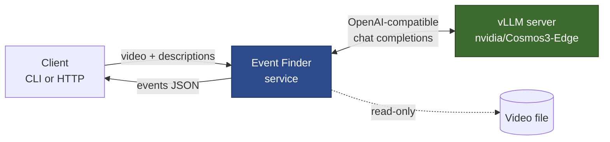
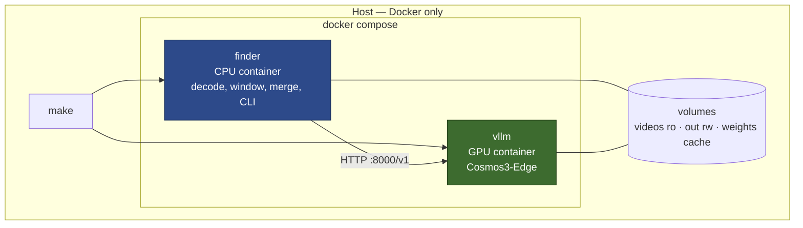
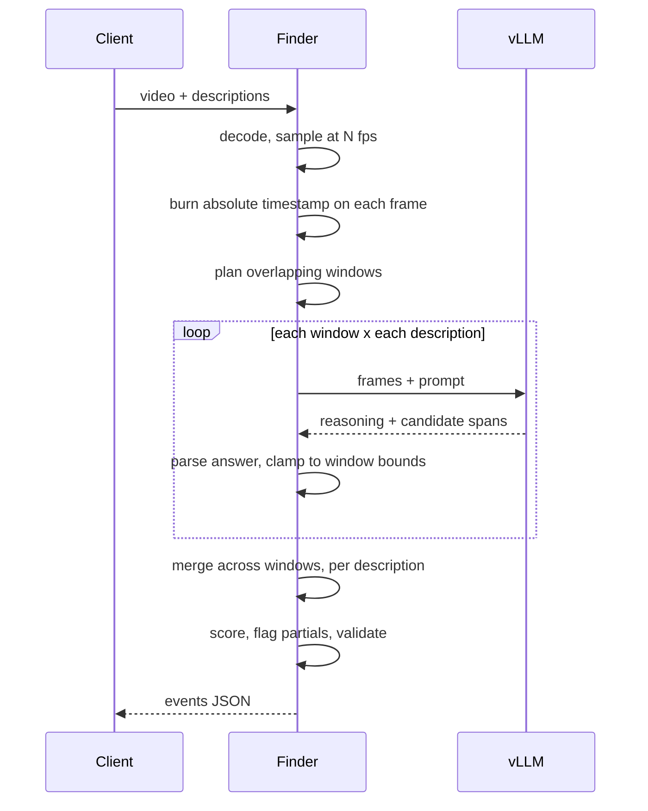
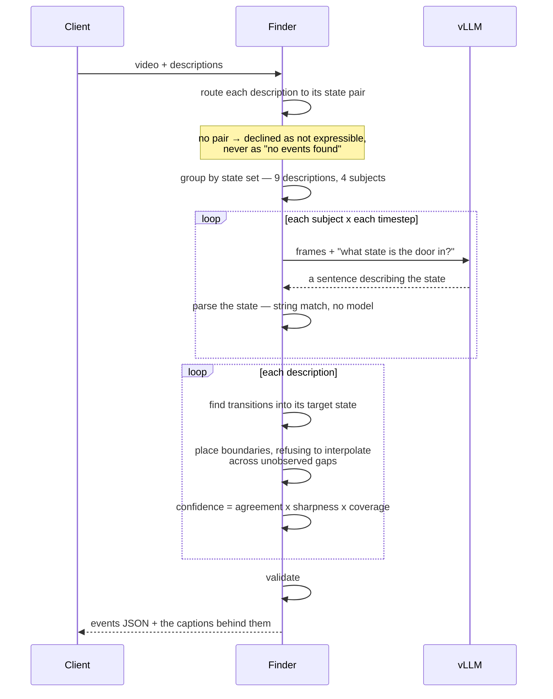
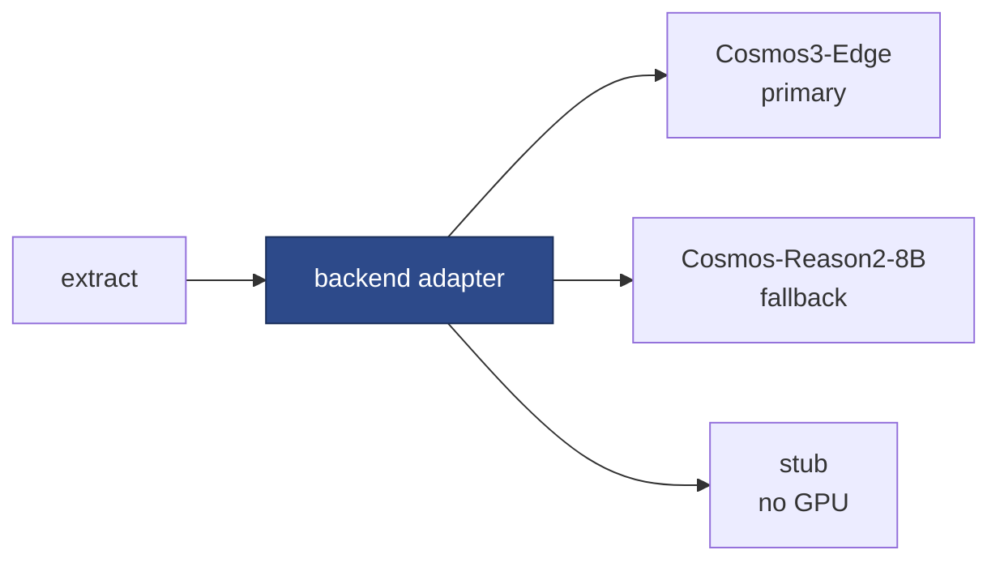
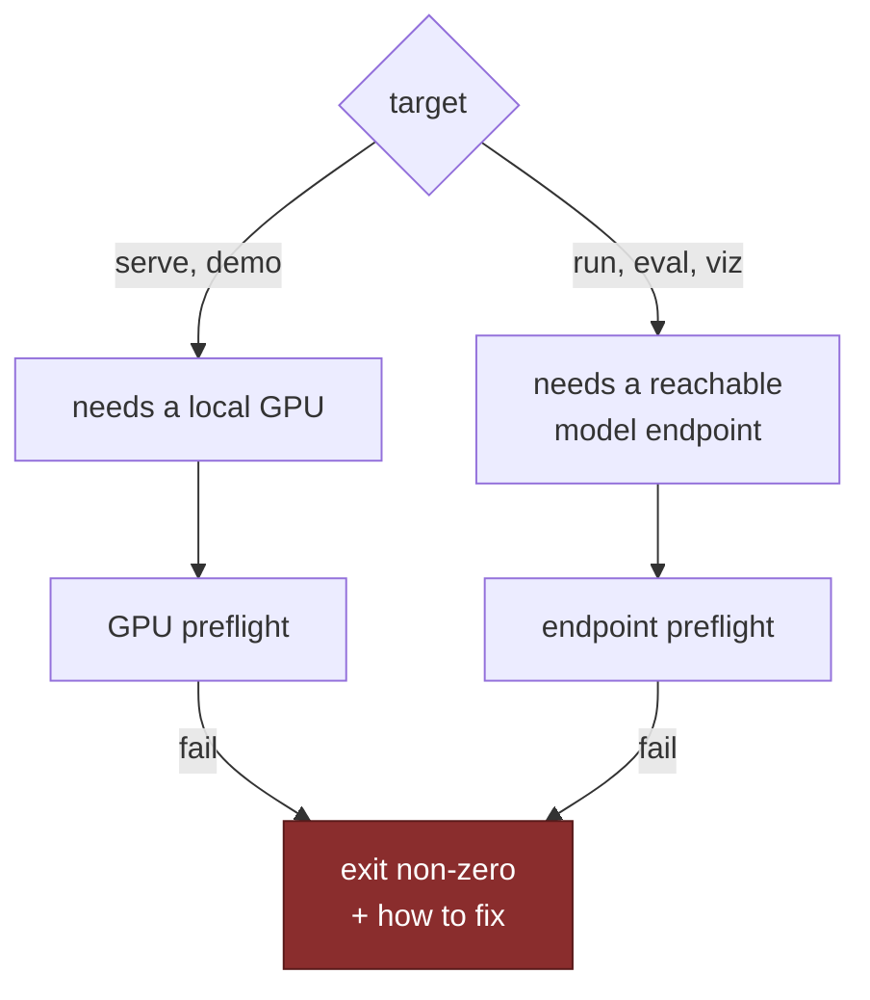
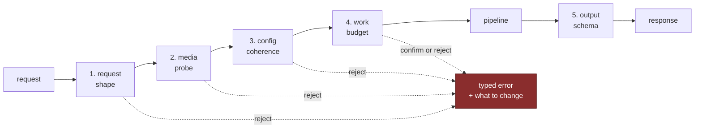

# Design — video event-finding service

High-level design: what the system is, how the pieces connect, and which decisions
are load-bearing. Working notes, verified facts and open risks live in
[`PLAN.md`](PLAN.md).

Status: **measured.** `nvidia/Cosmos3-Edge` was served on an NVIDIA L4 via vLLM
0.29.0 and run against the hand-labelled set — 1,352 model calls — plus a
capability probe on synthetic clips and a second on the real ones. The mechanisms
in §6 are built and their behaviour is verified separately from the model's, each
carrying the evidence below its rationale.

**The headline result is negative and specific: the model localises an event it is
told is present, and cannot establish whether one is present.** It reported an
event on 47% of (clip, description) pairs where the event existed and 39% where it
did not. Every tIoU-based number follows from that.

Three claims this document previously carried as hypotheses are now settled, and
one is withdrawn:

- **The timestamp-overlay prompt works better than the alternatives** (§6.1) —
  `overlay` answered on 100% of probe cases, `native` 80%, `terse` 40% at 15x the
  latency. `PASS`, measured.
- **The precision floor exists but does not generalise** (§10) — 3.50 s median
  boundary error on synthetic clips, where the event is guaranteed present. On
  real footage the same probe answered 13% of the time. The floor characterises
  the *stimulus*, not the model, and is withdrawn as a model property.
- **Absence of motion is the worst failure axis** (§9) — 7.74 s median error
  against 2.00 s for a visually similar distractor. This is one of the brief's own
  three worked examples.
- **Withdrawn:** that the model reports the tail of its window regardless of
  content. True across 12 samples, refuted across all 81.

Numbers are cited to a primary source, measured from our own code and labelled as
such, or measured from the model on hardware and labelled with the date.
Un-run work is marked `not measured` rather than estimated: three of the four
models in §7 never ran, and the Qwen-versus-Reason2 comparison remains open.

---

## 1. The contract

One call. In: a video file and one or more plain-language event descriptions.
Out: a list of events with absolute start and end times, the description each
matched, and a ranking signal — in a strict schema.

```
find_events(video, ["a forklift reverses", "the machine stops moving"]) -> Result
```

The client never sees frames, windows, prompts, model names or GPUs. That
concealment *is* the product: the caller describes what they are looking for in
their own words and gets back timecodes.

**Invariants the client can rely on**

| Invariant | Meaning |
|---|---|
| Absolute time | Every `start_s` / `end_s` is seconds from the start of the submitted video, never window-relative |
| Ordered | Events sorted by start time |
| No events is not an error | An empty list, HTTP 200 |
| Bounded | No event can be reported outside the video's real duration |
| Honest truncation | An event the model only partly saw is flagged, not silently clipped |
| Schema-validated | The response is validated before it leaves the process |

---

## 2. System context



Two processes, one boundary. The finder is stateless and holds all the logic; the
model server holds all the weights. They speak the OpenAI chat-completions
protocol, which is what makes the model backend swappable.

**Why split them.** Only the model server needs an accelerator. Everything else is
CPU work that runs anywhere. So a reviewer can exercise the entire pipeline —
decoding, windowing, merging, schema, evaluation — with the model server replaced
by a deterministic stub, then point the same client at a real GPU box by changing
one URL. Both run as containers; see §3.

---

## 3. Deployment — everything runs in Docker

**Nothing runs on the host.** No `pip install`, no Python version to match, no
system ffmpeg, no virtualenv. The only host requirements are Docker and — for the
GPU role — the NVIDIA container toolkit. This is the most direct answer available
to "we want to run it in a few minutes on a machine we own, without reading your
code first": the reviewer's machine state cannot break the run, because the run
does not touch it.



**Two images, two jobs.**

| Service | Image | Needs a GPU | Holds |
|---|---|---|---|
| `finder` | built from this repo, CPU-only | no | decoding, windowing, merging, schema, CLI, eval |
| `vllm` | pinned upstream vLLM image | yes | the model weights and nothing else |

**Volumes are the only surface.** Videos are mounted **read-only** — the service
cannot modify a client's footage. Results go to a writable output directory. The
weight cache is a named volume so a container restart does not re-download several
gigabytes, which would otherwise dominate the "few minutes" bar on a second run.

**Both services are declared in one compose file**, so the reviewer runs one
command. They can also be split across machines: the finder container on a laptop,
`BASE_URL` pointed at a GPU box elsewhere. The split is a configuration choice, not
a different build.

**Pinning.** Both images are pinned to exact tags, and the vLLM version is pinned to
one verified to serve this model. A floating `latest` tag is the single most likely
cause of "it worked for you and not for us", which is precisely the failure the
brief says it is strict about.

**The stub backend** ships inside the finder image, so the whole pipeline can be
exercised with no GPU and no model download at all. It proves the plumbing. It
never produces a reported metric — see §12.

---

## 4. Components

There are **two engines behind one `find_events`**, chosen by a flag, and the
second routes per description before spending anything.

```mermaid
graph TB
    Q["video + descriptions"] --> ST{"strategy"}

    ST -->|"windows — Approach 1"| W1["decode<br/>sample + timestamp"]
    W1 --> W2["extract<br/>ask WHEN"]
    W2 --> W3["merge<br/>stitch + dedup"]
    W3 --> OUT["schema<br/>validate"]

    ST -->|"states — Approach 3"| R{"has a<br/>state pair?"}
    R -->|"no"| DEC["declined<br/>not expressible"]
    DEC --> OUT
    R -->|"yes"| G["group by state set<br/>9 descriptions → 4 subjects"]
    G --> P["poll<br/>caption each step"]
    P --> PA["parse<br/>string match"]
    PA --> DV["derive<br/>transitions → events"]
    DV --> OUT

    W2 <-->|"chat completions"| M["vLLM"]
    P <-->|"chat completions"| M

    style W2 fill:#2d4a8a,stroke:#1a2f5a,color:#fff
    style P fill:#2d4a8a,stroke:#1a2f5a,color:#fff
    style M fill:#3d6b2f,stroke:#254019,color:#fff
    style DEC fill:#7a3b3b,stroke:#4a1f1f,color:#fff
```



**Only two boxes are blue, and they are the only ones that call a model.** That is
the whole argument for Approach 3: `parse` and `derive` are string matching and
arithmetic in code, doing the temporal reasoning the model was measured as unable
to do, while the model is left with the perception it can do.

| Component | Used by | Responsibility |
|---|---|---|
| `decode` | both | Open the video, sample frames at a target rate, optionally burn an absolute timestamp onto each |
| `windows` | windows | Plan overlapping windows; assign frames; cap frames per window |
| `extract` | windows | One `(window, query)` → candidate events, via the model adapter |
| `merge` | windows | Stitch candidates across window boundaries; de-duplicate; flag truncation |
| **router** | states | Description → state pair, or **declined**. Decided before any GPU spend |
| **`states.poll`** | states | Caption the clip on a grid, or only where the picture changed |
| **`states.parse`** | states | Read which state a caption asserts. Deterministic — a model was tried here and scored 0.00 |
| **`states.derive`** | states | Transitions → events, with confidence from agreement, sharpness and coverage |
| `motion` | states | Inter-frame change signal, for triggered polling |
| `schema` | both | The public contract, validated |

Data flows one way. Only `extract` and `states.poll` talk to the network, so
everything else is testable and debuggable offline.

---

## 5. Request flow

**Approach 1 — ask the model when the event happened.** One call per
`(window, description)`, doing three jobs at once.



**Approach 3 — caption, parse, derive.** The model is asked only what the scene
*is*. Notice where the loop sits: once per **subject**, not once per description,
and the model is never asked about time.



The asymmetry between the two is the finding. Approach 1 asks one question that
requires detection, localisation and formatting together; Approach 3 asks a
question with one job and does the rest in code.

---

## 6. The load-bearing mechanisms

### 6.1 Timestamp overlay

The model does not have a clock. It localises in time by **reading a timestamp
printed on the frame** — NVIDIA states this directly: *"Our AI model recognizes
timestamps added at the bottom of each frame for accurate temporal localization"*
([Cosmos-Reason2-8B model card](https://huggingface.co/nvidia/Cosmos-Reason2-8B)).
NVIDIA's own temporal-localization recipe does the same, via an adaptive
timestamp-burning script
([Cosmos Cookbook](https://nvidia-cosmos.github.io/cosmos-cookbook/recipes/post_training/reason1/temporal_localization/post_training.html)).

We burn **absolute, video-relative** time — `t=73.250s`, not `t=1.250s into
window 6`. Two consequences, both good:

- A timestamp the model reports is directly usable. No per-window remapping, so no
  class of off-by-one-window bugs can exist.
- Merging across windows is a comparison of numbers on one shared axis.

> **The mechanism is unconfirmed for our primary model.** The brief states that
> Cosmos 3 Edge "can localise events with timestamps **when prompted correctly**",
> so the *capability* is asserted by the people who set the task. What is not
> asserted is *how*. The burned-overlay mechanism is documented for Cosmos
> Reason 2; the `nvidia/Cosmos3-Edge` model card mentions temporal localization,
> timestamps and event detection **nowhere at all**.
>
> The two models also share little below the API. Edge runs a **Nemotron-H**
> language backbone — a hybrid Mamba-2/Transformer that replaces most self-attention
> with state-space layers — behind a **SigLIP2** vision encoder. Cosmos Reason 2 is
> Qwen3-VL-8B-based. Reading a burned-in timestamp needs the vision encoder to
> resolve small text *and* the model to bind that text to the frame's place in the
> sequence; neither transfers automatically between those architectures. Edge is
> also documented at robot-control resolution 640x360, so **overlay legibility is
> itself a variable to sweep**, not a fixed choice.
>
> So the first experiment on the GPU box tests **two** localisation paths against
> each other on a clip with known ground truth:
>
> 1. **Burned overlay** — this section's approach, documented for Cosmos Reason 2.
> 2. **Native video timing** — pass video through vLLM's video input path and let
>    the model's own frame-timing supply the clock.
>
> Whichever grounds events more accurately becomes the default; the other stays
> available as a config option. This is the capability probe of §10. The adapter in §7 is
> what makes the outcome a choice rather than a rewrite. Given the brief's qualifier, **prompt design is part of
> this experiment, not a detail to settle afterwards.**

### 6.2 Sampling rate

Two documented rates, from different sources, and they disagree:

- **4 fps** — the input rate NVIDIA documents for Cosmos 3 Edge reasoning and for
  Cosmos Reason 2, chosen to match the training setup.
- **8 fps** — what NVIDIA's temporal-localization recipe found optimal after
  testing 4, 8 and 12, against a target of **<30 % mean relative error** relative
  to event duration.

That target comes from a **post-trained** model on a specific dataset, so it is not
a zero-shot guarantee and will not be quoted as one.

We therefore treat fps as a **measured accuracy/cost knob**, not a default to
assert. Sampling rate sets the floor on boundary precision: at 4 fps no boundary
can be located better than 250 ms, before any model error. The repo will report the
sweep and pick from evidence.

### Sampling is not perfectly uniform, and the amount matters

Frames are taken at the first decoded frame *at or after* each target time, so each
lands slightly late. Measured, not derived:

| Source | Target fps | Max deviation | Drift |
|---|---|---|---|
| synthetic, 25 fps | 4 | 30 ms (12%) | +10 ms over 80 samples |
| synthetic, 25 fps | 8 | 35 ms (28%) | +5 ms over 160 |
| MEVA, 30 fps | 4 | **50 ms (20%)** | −33 ms over 121 |
| MEVA, 30 fps | **8** | **92 ms (73.6%)** | −33 ms over 241 |

The mean interval is correct to four decimal places, so this is jitter around the
grid rather than accumulating error — and the burned-in timestamp is the frame's
**actual** time, not the intended one, so nothing downstream is misled about when
a frame was taken.

**But at 8 fps the minimum gap on MEVA is 33 ms** — two samples landing on adjacent
source frames, i.e. the same moment sampled twice, spending a frame slot for no
coverage. Since 8 fps is a live candidate (NVIDIA's temporal recipe favours it),
this is worth stating rather than hiding: **acceptable at 4 fps, marginal at 8.**

Selecting the *nearest* frame to each target instead of the first at-or-after would
bound the error at half a source-frame interval and remove near-duplicates. Not yet
done; recorded here rather than discovered later as an unexplained wobble in the
precision floor.

**Consequence for interpreting results.** The effective floor at 4 fps is ~250 ms
plus up to ~50 ms jitter. Events shorter than about 300 ms can fall between samples
entirely — which is exactly why the synthetic set contains a deliberate `short`
clip with 0.15 s and 0.2 s events.

### 6.3 Windowing

A video is longer than the model can attend to at once, so we slide a fixed-length
window with a stride shorter than the window.

```
video   ├──────────────────────────────────────────────┤
w0      ├──────────┤
w1            ├──────────┤
w2                  ├──────────┤
              ╰────╯  overlap
```

- **Window length** bounds frames per call, and therefore vision tokens per call.
  It is the knob that keeps cost per call constant no matter how long the video is.
- **Stride < window ⇒ overlap.** Overlap is the entire answer to "what about an
  event that straddles a boundary": with an overlap wider than the longest event we
  care about, that event appears *whole* in at least one window.
- **Frame cap per window.** Even at fixed fps, frames per call are capped and
  subsampled uniformly if exceeded, so a pathological input cannot blow the context
  limit.

Overlap trades cost for recall linearly: overlap fraction *f* multiplies the number
of model calls by roughly `1/(1-f)`. Defaults will be set from the sweep, and the
relationship documented so a client can move the knob knowingly.

**Implemented** in `windows.py`. Verified behaviour:

| Property | Measured |
|---|---|
| 20 s video at 12 s window / 9 s stride | windows `[0.0, 12.0]` and `[9.0, 20.0]` |
| First window starts at 0, last ends exactly at duration | yes — no unobserved footage, none past the end |
| Overlap | 3 s, as configured |
| 5-minute clip, 2 descriptions | 33 windows, **66 model calls**, computed *before any call* |

That last row is what makes the work-budget refusal possible: cost is fully known
from the inputs, so an oversized job is refused rather than discovered an hour in.

Frames are subsampled **uniformly, never truncated**. Keeping the first N would
silently make every window cover only its opening seconds, so events late in a
window would vanish while everything still appeared to work.

### 6.4 Merging across windows

Overlap guarantees duplicates. Each real event appears as a candidate in every
window that saw it. Merging runs **per description**, so two different queries can
never collapse into each other.

```
candidates   ├────┤  ├─────┤
                  ├────┤
merged       ├────┴──┴─────┤   one event, provenance = {w0, w1, w2}
```

Two rules matter more than the thresholds:

- **Bounded chaining.** A merge rule that compares each new candidate to a *running
  span* whose end keeps advancing will chain a dense candidate stream into one
  giant event. The merge must be bounded so that a busy video does not collapse
  into a single detection covering everything.
- **Non-saturating agreement.** Agreement across independent windows is the
  cheapest real evidence available, and it falls out of the merge for free. But if
  agreement only ever pushes confidence up, everything converges on 1.0 and the
  ranking signal the brief asks for stops discriminating. Agreement must inform the
  score without saturating it.

**Implemented** in `merge.py`. Verified behaviour:

| Property | Measured |
|---|---|
| 200 deliberately overlapping candidates | collapse to **2 events**, max span 59.8 s against the 60 s cap |
| Unbounded equivalent | would have produced **1 event covering the whole video** |
| Confidence, 1 / 2 / 5 / 20 agreeing windows | 0.582 / 0.815 / 0.960 / **0.970** |

The confidence row is the point: it approaches a ceiling *below* 1.0, so ordering
survives agreement. With a ceiling of exactly 1.0, everything past about five
windows would be indistinguishable and the ranking signal would be dead.

Merging is strictly per description. Two descriptions matching the same moment are
two findings; collapsing them would silently discard one.

### 6.5 Ranking signal

Deliberately labelled a **heuristic ranking signal, not a calibrated probability**.
Calibrated confidence from a zero-shot VLM is an open research problem, and
claiming otherwise would be the easiest thing in this repo to disprove.

It combines the model's self-reported confidence — a weak prior — with cross-window
agreement, which is independent evidence. It is good enough to sort results and to
threshold. It is not a probability, and the schema documentation says so.

### 6.6 Partial events

After merging, an event can still touch the edge of the region any window actually
observed — at the video's start or end, or where no overlapping neighbour confirmed
it. Its true extent is then unknown.

Reporting a clipped span as if it were exact is a quiet lie. Such events are
flagged instead, so a client can decide whether to trust the boundary. Sufficient
overlap prevents most of these; the flag surfaces the remainder honestly.

The distinction the implementation draws is between **"the event ended here"** and
**"this is where we stopped looking."**

**Implemented** in `merge.py`. Verified behaviour:

| Case | `partial` |
|---|---|
| Touches a window edge, seen by one window only | **true** — extent unknown |
| Mid-video, seen by one window | false — the boundary was observed |
| Touches a window edge, but **two windows confirm it** | **false** — independent confirmation means it was observed, not merely where looking stopped |
| Touches the video's own start or end | **true** — the footage does not exist either side |

---

## 7. The model adapter

`extract` is the only component that knows a model exists, and it talks to it
through a narrow adapter:



**Why this seam exists, concretely.** It is not speculative generality — it is a
hedge against one specific, identified risk.

The design in §6 rests on the model reading burned-in timestamps. For the primary
model that is **undocumented**, and the primary and fallback models are different
architectures all the way down: Nemotron-H + SigLIP2 at 4B versus Qwen3-VL-8B, one
ungated and one gated, with their own prompt conventions and documented frame
rates. Cosmos 3 is also a reasoning model, so a response carries a reasoning pass
before the answer and cannot be parsed as bare JSON.

If the timestamp test fails, what has to change is confined to one component:
prompt shape, response parsing, and possibly the whole localisation strategy for
that backend. Everything in §6.3 through §6.6 — windowing, merging, scoring,
partial-event handling — is arithmetic over `(start, end, score)` tuples and does
not care which model produced them. **Putting the seam here means a negative
result costs a config change and one new adapter, not a redesign.**

The adapter's job is to absorb that: prompt construction, response parsing, and
clamping every reported timestamp into the window's real span so a window can never
emit an event outside the footage it saw. Swapping backends is configuration.

**Response parsing is where this seam earns its keep.** Cosmos 3 is a *reasoning*
model — vLLM's `--reasoning-parser qwen3` exists precisely because it emits a
`<think>` block before answering. Code that assumes bare JSON fails on every
response. Verified behaviour of `backends/base.py`:

| Response shape | Result |
|---|---|
| `<think>...</think>` followed by JSON | 1 event parsed |
| JSON in a ` ```json ` fence | 1 event parsed |
| Prose wrapped around `{"events": []}` | 0 events, **no error** |
| A bare list instead of the documented object | 1 event parsed |
| Truncated mid-`<think>` | 0 events, **flagged as truncated** |
| A refusal, or any unparseable text | 0 events, flagged unparseable |

The third and fifth rows carry the important distinction: *"the model reports
nothing happened"* is a valid answer, while *"the model returned something we could
not read"* is a failure. Conflating them would turn every parse failure into a
confident zero — silently lowering recall while looking like a clean run.

### Reported times: clamping alone makes things worse

Models report times for footage they never received. The obvious response is to
clamp into the window's span — and on its own that is **worse than doing nothing**.

A model reporting `t=400s` for a 12-second window is unmistakably hallucinating.
*Clamped*, it becomes a confident event at the window edge: indistinguishable from
a real detection, no longer flagged as anything, and merged into the output as
evidence. **Clamping converts a detectable error into an undetectable one.**

So `reconcile_times` gives three different failures three different answers:

| Reported time | Response | Why |
|---|---|---|
| Within ~1 s of the window | **clamp** | Consistent with rounding or a misread digit. The event is real, the boundary is fuzzy |
| Far outside the window | **reject, and count it** | The model is not reporting something it saw. Dropping it is honest; clamping it is fabrication |
| **Near no frame we actually sent** | **reject, and count it** | The strongest check available, and one only we can make |

That third rule is the useful one. We know the exact timestamps burned into every
frame of the window, so *"could the model have read this time?"* is answerable
rather than approximated. A reported time near none of them was never on screen.

Rejections are **counted and returned, not swallowed**. A model that hallucinates
often is a finding about the model, which is precisely what the brief asks us to
report — so the rate belongs in the results, not in a silent filter.

Reported times are then **clamped into the window's real span**, because models
report times for footage they never received. Unclamped, those merge with genuine
detections and become indistinguishable from them.

**Prompts are data, not string literals.** The brief says Edge localises "when
prompted correctly", so `backends/prompts.py` holds named variants that can be
swept and reported on: `overlay` (read the burned-in timestamp, per NVIDIA's
recipe), `native` (ask for time without mentioning overlays — does it localise some
other way?), and `terse` (a minimal control: if it matches the others, the
elaborate prompting was not what made the difference).

**Backends**

| Backend | Role | Notes |
|---|---|---|
| `nvidia/Cosmos3-Edge` | Primary | 4B, OpenMDW 1.1, **not gated**. Natively served by stock vLLM as `Cosmos3EdgeForConditionalGeneration` — Nemotron-H backbone with a SigLIP2 vision encoder. Recommended by the brief. Timestamp localisation **undocumented** — see §6.1 |
| `nvidia/Cosmos-Reason2-8B` | Fallback | Documented timestamp localisation and fps. Gated, needs a token — hence fallback, not default |
| stub | Development | Deterministic, GPU-free. Proves the pipeline; stamped `stub` and barred from producing a metric |
| **replay** | Development | **Real recorded responses, replayed with no GPU.** One GPU session records genuine exchanges; all later parser, prompt and merge work then runs on a laptop against real model output — including the malformed responses the parser has to survive. It also makes an odd response a permanent fixture rather than a story |

**On serving.** Cosmos 3 is a **Mixture-of-Transformers**: one model, two towers.
The **Reasoner** is autoregressive and interprets multimodal input into text — the
"brain". The **Generator** is a diffusion transformer that synthesises future
video, audio and action by iterative denoising, conditioned on the reasoner.
NVIDIA states that *the reasoner operates independently, while generation requires
both towers together*.

Our task is video in, timestamped text out. That is the Reasoner alone; we never
generate anything. **"Omni" refers to the union of modalities across both towers**,
and **vLLM-Omni** is the separate project that serves the diffusion generator —
which the `--omni` flag switches on. Since we do not generate, `--omni`, the
`vllm/vllm-omni:cosmos3` image and `--no-guardrails` are all out of scope, and
stock vLLM serving the understanding tower is the entire requirement. That keeps
the reviewer's setup to one standard vLLM container.

---

## 8. Output schema

```jsonc
{
  "video": "warehouse_02.mp4",
  "duration_s": 142.6,
  "queries": ["a forklift reverses"],
  "model": "nvidia/Cosmos3-Edge",
  "events": [
    {
      "description": "a forklift reverses",   // which query this matched
      "start_s": 12.40,                       // absolute, seconds from video start
      "end_s": 15.10,
      "confidence": 0.82,                     // ranking signal, NOT a probability
      "evidence": "forklift moving backward toward the rack",
      "partial": false,                       // true if truncated by an observation edge
      "source_windows": [1, 2]                // provenance
    }
  ]
}
```

`evidence` and `source_windows` are there so a result can be argued with. A client
who disagrees with a detection can see what the model claimed to see and which part
of the video produced it — which is what makes the output debuggable rather than
merely machine-readable.

Field names, units and the exact shape are fixed by a schema definition in the
code, validated on the way out. Any change to it is a breaking change to the
contract.

---

## 9. Evaluation design

The brief asks for a hand-labelled set and a temporal metric we can defend.

**The set.** 5–10 clips, 1–3 minutes, hand-labelled with start and end times, mixing
two kinds:

- **Synthetic** clips, where ground truth is exact by construction. These calibrate
  the system and isolate its error from labelling error.
- **Real** footage, which is the only thing that proves it works. Fixed-camera
  operational footage is the target domain.

**As built: 8 clips, 120 s each, 15 hand-confirmed events** (`data/eval/labels.json`),
covering all three of the brief's worked examples — *"a person enters through the
door"*, *"a forklift reverses"* (`Vehicle_Reversing`), *"the machine stops moving"*
(`Vehicle_Stopping`) — with durations from 1.4 s to 13.6 s.

**A precondition the design did not originally state: an event is only evaluable if
a human can label it.** This sounds trivial and is not, because it is invisible
until someone tries. Clips were first selected because their annotation *declared*
an activity; eight of fourteen candidates then turned out to show that activity at
26–124 px, where there is no boundary for a person to read. A score computed
against such a label measures the labeller, not the model.

So clip selection now carries a **measurable gate ahead of it** — the actor's
median bounding-box height during the event, taken from the dataset's own geometry
annotations before any video is downloaded, and calibrated against verdicts reached
by eye. It ranks rather than rejects: a false positive costs a glance at a contact
sheet, a false negative removes a clip silently and leaves no trace that it existed.
→ [`DATASETS.md`](DATASETS.md), [`DECISIONS.md §4d`](DECISIONS.md)

**Clips that fail that gate are kept, not discarded.** Three of them are excluded
from every score and used for something no labelled clip can test: the dataset
declares events in them that no human can verify, so asking the model for those
events measures whether it produces confident timestamps in the absence of readable
evidence. Reported separately — with no ground truth, it is a hallucination probe,
not an accuracy measurement.

**The metric.** Event-finding is temporal grounding, so we report **temporal IoU**
based metrics, standard in the moment-retrieval literature:

- Recall@1 at tIoU ∈ {0.3, 0.5, 0.7} — does the top-ranked prediction overlap the
  truth enough?
- Mean tIoU of the best-matching prediction per labelled event.
- Detection precision and recall at a fixed tIoU, for the multi-event framing.
- Latency and cost per video-minute — for an inference service, cost is a result.

Exact-boundary match is deliberately not used. Hand labels are fuzzy and so is the
model; a threshold on overlap is the honest bar. Reporting several thresholds
rather than one shows where accuracy actually falls off.

**Metric isolation.** Metrics are computed per video and then aggregated. Query
strings repeat across clips by design, so pooling all predictions and all labels
into flat lists would let a prediction from one clip satisfy a label in another and
silently inflate every number.

**What we are looking for.** Roboflow has published its own Cosmos 3 evaluation
([blog.roboflow.com/cosmos-3-vision](https://blog.roboflow.com/cosmos-3-vision/)),
finding that it segments activity into structured state sequences reliably without
fine-tuning and handles slow-changing states well, while struggling with
fast-moving actions and with small, similar objects. Our eval set deliberately
spans those cases. Confirming or contradicting a published finding with our own
measured numbers is a more useful answer to "where are the limits" than a table of
scores with no hypothesis behind it.

Expected weak points, to be confirmed or refuted rather than assumed: boundary
precision at tight tIoU, absence-of-motion events such as "the machine stops"
compared with distinctive motion, events shorter than the sampling interval, long
events spanning many windows, and visually similar distractors.

---

## 9a. Information leakage in evaluation data

Some footage carries its own answers. MEVA publishes 121 curated example clips
named for the activity they contain — and those clips have MEVA's annotations
**burned into the picture**: a red box around the actor, labelled with the
activity name, plus a header giving the source file and frame number.

A model shown such a frame can read `Enter_Vehicle` off the image. Score it and
you measure OCR, not event recognition — and the score will look excellent.

### Prevention is impossible; containment is not

The leak is in the pixels. It cannot be removed, cropped out (the label box tracks
the actor), or undone. Three separate responses, and only the last two are
available:

| | |
|---|---|
| **Prevent** | Impossible. The annotation is rendered into the video |
| **Contain** | Quarantine the clips so they cannot reach a reported number |
| **Repurpose** | Use the leak deliberately, as a ceiling test |

### Repurposing it: the ceiling test

If the model cannot localise an event whose *name is written on the frame in a box
around the person doing it*, it will certainly fail on clean footage. That is a
decisive result for seconds of GPU time, and it separates failure modes that
clean footage alone cannot:

| Behaviour | Conclusion |
|---|---|
| Fails **with** the answer on screen | Cannot read the frame or follow the task. The problem is prompting or vision, not event recognition |
| Succeeds with the label, fails without | Recognises **text**, not **events** — the interesting finding |
| Succeeds at both | The pipeline limits the result, not the model |

These clips are labelled with the `positive_control` axis.

### Containment, enforced in code

Three guards, because a convention would eventually be forgotten:

1. **Control axes are excluded from headline metrics.** `metrics.CONTROL_AXES`
   names them; `evaluate.py` filters both truths and predictions before computing
   `overall`, and records what it excluded in `overall_excludes`.
2. **A labels file may not mix control and evaluation clips.** Refused with an
   error, for a reason that is not obvious — see below.
3. **Control results are reported on their own row** of the per-axis table, never
   averaged into anything.

Verified rather than asserted: a mixed set of 6 synthetic clips (7 truths) and 2
control clips (2 truths) produced a headline computed over **7 truths, not 9**.

### Why mixing files is refused, not merely discouraged

Every description in a labels file is asked of **every clip in that file** — which
is deliberate, because a system only ever asked questions whose answer is "yes"
has no measurable false-positive rate.

The side effect is that adding control clips to an evaluation file also adds their
descriptions to the questions asked of the real clips. The query set grows, the
false-positive denominator moves, and two runs stop being comparable — while every
number still looks entirely reasonable. So the files stay separate, and
`make eval-control` runs the ceiling test on its own.

### The general rule

Leakage of this kind is a property of the *data*, discovered by looking at it.
Nothing in the pipeline can detect that a dataset has written the answers on its
own frames. It was found here by rendering a contact sheet and reading it — which
is the argument for looking at evaluation footage before trusting a number
computed from it.

A second instance found the same way, and worth stating because the failure is the
opposite shape: footage that carries no answers at all, because the actor is 38 px
across. Both are invisible to every automated check the pipeline runs, both are
obvious within seconds of looking, and both would have produced a confident number
— one far too high, one far too low.

---

## 9b. Testing the model path without a model

The stub backend proves the *pipeline*. It proves nothing about the code that sits
between us and the model — HTTP, authentication, reasoning-block parsing, time
reconciliation, recording, the model-identity check. All of that is where the
expensive surprises live, and none of it needs a GPU.

So a **fake endpoint** speaks the OpenAI-compatible subset vLLM serves, and returns
the responses that actually break parsers:

| Scenario | Returns | Expected |
|---|---|---|
| `think` / `plain` / `fenced` / `prose` | reasoning block, bare JSON, fenced JSON, JSON in commentary | events found |
| `empty` | a valid "nothing happened" | 0 events, **no error** |
| `truncated` | stops mid-`<think>`, as at `max_tokens` | 0 events, flagged |
| `refusal` | natural language, no JSON | 0 events, flagged |
| **`hallucinate`** | timestamps far outside the window | **0 events** — rejected, not clamped |
| `malformed` | JSON-ish with wrong field types | 0 events |
| `mixed` | a different failure per call | reproducible rotation |

A happy-path fake would prove almost nothing; the point is the failures.

### The harness must be able to fail

Its first version checked only three things: exit code, that the output parsed, and
that no event fell outside the video. A hallucinated timestamp *clamped* to the
window edge satisfies all three — so it **passed both before and after** the bug it
existed to catch. Assertions that cannot fail are decoration.

Each scenario now declares an expected event count, and the harness is verified
against deliberate regressions:

| Injected fault | Detected |
|---|---|
| A deliberately wrong expectation | `FAIL expected 1-9` |
| Time rejection removed, clamping restored | `hallucinate: 2 events, FAIL expected 0-0` |

The second is the one that matters: it is the exact regression the earlier version
missed.

---

## 10. The capability probe

Before the pipeline is trusted, the model is characterised. This is a first-class
component, not a debugging script.

**Why it exists.** The brief asks us to *"understand what it actually guarantees"*
and to report *"where the limits of their abilities are"*. It also states that
Cosmos 3 Edge "can localise events with timestamps when prompted correctly". That
statement is treated here as a **hypothesis to test**, not a specification to build
against — the model card documents no such capability, and inheriting the claim
untested would skip the part of the work that matters.

**What it measures.** On short clips with exact, constructed ground truth — where
labelling error is zero by design — the probe answers four questions:

| Question | Why it decides something |
|---|---|
| Does Edge report event times at all, in a parseable form? | If not, the whole approach changes and we find out on day one |
| **Which mechanism grounds better** — timestamps burned into frames, or vLLM's native video-timing path? | The brief does not say which Edge uses. Burned overlays are documented for Cosmos Reason 2 only |
| At what **precision floor**? Absolute error against known truth | Every downstream metric is read against this number |
| How does that degrade with clip length, event duration, sampling rate and overlay legibility? | These are the knobs; this tells us which ones matter |

**Why the precision floor is the important output.** It separates *the model's*
error from *our pipeline's*. Without it, a mediocre tIoU is unattributable — we
could not say whether the windowing, the merging, or the model was responsible. With
it, every later result has a baseline to be judged against, and the failure analysis
the brief asks for becomes evidence rather than speculation.

**It is cheap and it runs first.** Seconds of footage, a handful of model calls, a
single GPU-hour. It is the first thing executed when a GPU box comes up, before any
eval set is processed.

**Its result is published in the repo either way.** A negative — "the recommended
model could not ground events to better than X, so we did Y" — is a finding the
brief explicitly asks for, and is more useful than a number produced by a model
nobody checked.

---

## 11. Operational interface — Make

`make` is the front door, and **every target is a thin wrapper over `docker
compose`**. No target ever executes project code on the host. The brief's bar is
that a reviewer runs this in minutes without reading the code, so target names have
to be guessable and parameters have to be visible.

```
make help          # self-documenting target list, printed from the Makefile itself
make preflight     # host and container environment checks; run automatically
make probe         # characterise the model: can it ground events, and how precisely
make build         # build the finder image, pull the pinned vLLM image
make serve         # start the model container on the local GPU
make demo          # end-to-end: sample clip + queries -> events JSON  (the front door)
make run           # find events in YOUR video
make eval          # run the labelled eval set, print the metric table
make sweep         # fps / window / stride frontier
make viz           # render the result timeline
make down          # stop containers
make clean         # also drop the weight cache volume
```

Each resolves to something of the shape
`docker compose run --rm finder <cli command>`, with the video mounted read-only
and results written to a mounted output directory.

Every target is parameterised by environment variable, with defaults that work:

| Variable | Default | Purpose |
|---|---|---|
| `MODEL` | `nvidia/Cosmos3-Edge` | Model id. Switching backends is this variable |
| `BASE_URL` | `http://localhost:8000/v1` | Point at a remote GPU box instead of a local one |
| `VIDEO` | the sample clip | Input video for `run` |
| `QUERIES` | sample queries | Newline- or semicolon-separated descriptions |
| `DATASET` | the bundled eval set | Which labelled set `eval` runs against |
| `SAMPLE_FPS` `WINDOW_S` `STRIDE_S` | from config | The sampling and windowing knobs |
| `GPU_HOURLY` | unset | Instance price, for the cost-per-video-minute figure. **Unset means cost is not reported** rather than reported wrongly |
| `ALLOW_NO_GPU` | unset | Explicit opt-in to the stub path. See §12 |
| `OUT_DIR` | `./out` | Host directory results are written to |

Three rules keep this honest:

- **`make help` is generated from the Makefile**, so the documented interface
  cannot drift away from the real one.
- **Defaults are real.** `make demo` with no arguments must produce a real result,
  because that is the command a reviewer will actually type first.
- **Host paths are translated, not assumed.** `VIDEO=/some/path/clip.mp4` is
  mounted into the container and rewritten to the container path, so a caller never
  has to think about the container boundary.

Datasets and models are declared in config files rather than hardcoded in recipes,
so adding either is a data change. The Makefile stays a thin, readable layer over
compose and the CLI — anything with real logic in it belongs in Python, where it
can be debugged.

---

## 12. Preflight and GPU gating

**The subtlety: only one of the two processes needs a GPU.** The finder decodes
video, plans windows and merges results — all CPU work. The model server is what
needs the accelerator. Gating the whole system on a local GPU would break the
legitimate case where the reviewer runs the CLI on a laptop against a GPU box
elsewhere, which is exactly what `BASE_URL` is for.

So the gate goes where the requirement actually is:



**GPU preflight** — required before serving locally, and phrased in Docker terms
because that is where the model actually runs. Each check fails hard, names what it
found, and says what to do about it:

| Check | Failure means |
|---|---|
| Docker daemon reachable, compose available | Nothing can run at all |
| `docker run --rm --gpus all <cuda image> nvidia-smi` succeeds | The single most valuable check: it proves in one command that a GPU exists, the driver works, **and** the NVIDIA container toolkit is installed. Testing `nvidia-smi` on the host would pass while containers still had no GPU — the most common silent failure |
| Reported VRAM ≥ the selected model's requirement | Wrong instance size. The threshold comes from the model registry, so it moves with `MODEL` |
| Driver / CUDA version within the pinned vLLM's supported range | vLLM will fail later and far less clearly |
| Free disk ≥ the weight cache requirement | The weight download dies partway |

**Endpoint preflight** — required before any client target: the endpoint answers,
and it is serving the model we think it is. A mismatch between `MODEL` and what the
server actually loaded produces results attributed to the wrong model, which is
worse than an error.

**Failure is loud and non-zero.** No silent degradation, no automatic fallback to
the stub. A run either used the real model or it failed.

**The one escape hatch.** `ALLOW_NO_GPU=1` selects the stub backend so the pipeline
can be exercised with no accelerator. It is opt-in only, it prints a banner on
every run, its results are stamped as stub-generated in the output, and the eval
harness **refuses to compute metrics** from them. Convenience for development must
not be able to masquerade as a result.

---

## 13. Input validation

Validation happens in stages, cheapest first, so a bad request fails in
milliseconds rather than after a GPU has been paid for.



**1. Request shape** — no file touched yet. Video path exists and is readable;
file size within the configured maximum; container format in the allowlist. At
least one query; each non-blank and within a length bound; query count within a
maximum; duplicates rejected rather than silently deduplicated, since a duplicate
usually means the caller made a mistake.

**2. Media probe** — metadata only, no full decode. The file is genuinely a video
with at least one video stream. Duration within bounds — a lower bound catches
truncated uploads, an upper bound is a real limit we state rather than discover.
Resolution and frame rate within sane ranges.

**3. Config coherence** — the knobs must describe a system that can work:

| Constraint | Why it is not optional |
|---|---|
| `0 < stride_s ≤ window_s` | Stride greater than window leaves **unobserved gaps** — footage nothing ever looks at. Silently missing events there is the worst failure this system can have |
| `sample_fps > 0`, within a supported range | Below the model's documented rate, temporal localisation degrades in ways the metrics will not explain |
| `max_frames_per_window` ≥ a floor | Too few frames per call and the model cannot see the event at all |
| merge thresholds within their valid ranges | Out-of-range values silently produce either one giant event or no merging |

An overlap of zero is legal but warned about, because it removes the mechanism
that recovers boundary-straddling events.

**4. Work budget** — the check that protects the wallet. Before any model call, the
work is fully predictable from the inputs:

```
frames  = duration_s x sample_fps
windows = ceil((duration_s - window_s) / stride_s) + 1
calls   = windows x queries
```

If the estimate exceeds the configured budget, the run **stops and reports the
estimate** — call count, frame count, projected wall time — rather than starting a
job that quietly runs for hours. Raising the budget is explicit. A two-hour video
with ten queries should be a decision, not an accident.

**5. Output schema** — the result is validated before it leaves the process, so a
malformed response is our error and never the client's problem.

**Error model.** A small exception hierarchy, each mapping to a stable exit code
and HTTP status: invalid input, unprocessable media, misconfiguration, budget
exceeded, backend unavailable. Every message states what was wrong, what was
expected, and which parameter changes it. `UnprocessableMedia` is distinct from
`InvalidInput` because "your file is not a video I can read" and "you asked for
something impossible" need different responses from the caller.

---

## 14a. Two approaches, and why there is a second

Everything above §14 describes **Approach 1**. It was built to the brief's own
phrasing — *"a plain-language description of what to look for"* — and it does not
work. Approach 2 exists because Approach 1's failure was specific enough to point
at a different design.

### Why one call was the wrong shape

Approach 1 issued **a single model call per (window, description)** and asked it to
do three jobs at once:

1. decide whether the described event is present in these frames
2. locate its start and end
3. report those times in valid JSON with a confidence

The measured failure separates cleanly along those lines. It could do (3) after the
parser repair — 28 of 30 responses parsed. It could do (2) when told the event was
present — 3.5 s median boundary error on synthetic clips. It could not do (1) at
all: an event was reported on 47% of pairs where one existed and 39% where none
did. One capability out of three, and the call returned a single answer that mixed
them, so a wrong output never said which stage had failed.

That is the general failure of a complex single call: **the output cannot be
attributed to a stage, so it cannot be debugged.** Every diagnostic that eventually
worked came from splitting the job — the probe separated localisation from
detection, and the caption stage separated perception from scoring. Neither was
visible while one call did everything.

Approach 3 is the decomposition:

```
caption (model)  ->  parse state (code)  ->  derive transition (code)
```

One model call does one thing it is good at — describing what is visible. The two
stages that were silently wrong in Approach 1, deciding presence and reporting
time, are now deterministic code whose behaviour can be tested without a GPU.

### Routing: choose the engine from the sentence

Not every description decomposes into a state. Ten of our fifteen labelled events
do; five do not, and no prompt engineering changes that — *"someone hands an object
to another person"* is a relation between two actors, not a binary property of one
object.

So the strategy is a **routing decision made from the client's sentence, before any
GPU time is spent**:

| the description… | engine |
|---|---|
| names a persistent thing with two states | `states` — caption, parse, derive |
| does not | reported as **not expressible**, not answered |

**Why "not expressible" rather than falling back to `windows`.** Approach 1 is
available and would produce an answer for those five. It would also be an answer we
have measured as uninformative — R@1 0.000, and presence reported at nearly the
same rate whether or not the event occurs. Returning a known-bad answer where a
client expects a real one is worse than returning nothing and saying why. The
brief asks for a system a client can call; part of that is refusing questions the
system cannot answer.

**What is implemented:** `states_map` presence acts as the router — a description
with no entry is skipped and reported. **What is not:** deriving the state pair
from the sentence automatically, so a human still writes the mapping. That is one
cheap text call, and it would correctly fail to produce a pair for the five, which
is the router's decision function falling out of the derivation step.

### Approach 1 — ask when the event happened

Sample frames, burn absolute timestamps onto them, split into overlapping windows,
ask the model to report start and end times for a description, merge across window
boundaries.

**Measured:** 8 clips x 13 descriptions x 13 windows = 1,352 calls.

| | |
|---|---|
| R@1 at tIoU 0.3 / 0.5 / 0.7 | 0.000 / 0.000 / 0.000 |
| mean tIoU | 0.002 |
| false-positive rate | 0.802 |
| mean relative error | 3.151 (NVIDIA target <0.30) |

**Why it failed, precisely.** Across 104 (clip, description) pairs the model
reported an event on **47%** of the 15 where one existed and **39%** of the 89
where none did. Its output is close to uncorrelated with whether the event is
there. A follow-up probe separated the two abilities: given a clip where the event
is guaranteed present, it localises to 3.5 s median error on synthetic footage —
but on real footage under the same conditions it declined 13 of 15 times.

So the model can place an event it is *told* is present, and cannot establish the
"told". Every temporal metric is downstream of that.

**It is not the model's fault alone.** `Cosmos-Reason2-2B` — whose model card
documents the burned-in timestamp mechanism that Cosmos3-Edge's does not mention —
did *worse* on the same probe: 20% answered against 100%. Two architectures, same
failure. That rules out the comfortable explanation that the brief simply named
the wrong model.

### Why Approach 2

Three measurements pointed the same way:

1. **The model cannot decide presence** — but its yes/no logprobs vary
   meaningfully, so the *signal* exists even when the *decision* is wrong.
2. **We have no evidence it reads the burned-in timestamps reliably.** Every
   number in Approach 1 sits downstream of an unverified mechanism.
3. **Roboflow's published Cosmos 3 evaluation reports the same weaknesses**
   independently — fast motion and small objects. That corroborates the Approach 1
   result on different footage with a different harness, which is worth more than
   another run of our own.

The conclusion drawn from (1) and (2): stop asking the model to report a time, and
stop asking it to decide anything. Use it as a noisy sensor, sampled repeatedly,
and do the temporal reasoning in code.

**One published remedy was tested and did not work.** Roboflow report that
isolating a region of interest and running inference per region beat one combined
call. We implemented it — a fixed fractional crop, applied at native resolution
and resized back up — and measured it on the clip Approach 2 was failing:
`admin.G329`'s score range went from 0.12 uncropped to 0.07 cropped. The
underlying hypothesis, that subject size in frame is what limits the signal, was
then disproved outright: a **car door succeeds at 322 px** while a **person in a
doorway fails at 295 px**. Whatever separates them is not size.

So the design below is not that recipe. Its mechanisms — polling a closed state
set, cancelling option-order bias by asking in both orders, differencing the
logprobs, and detecting a sustained departure from the clip's own baseline — come
from what Approach 1 measured, not from prior art.

### Approach 2 — poll the state, derive the event

For a description like *"a person opens a building door"*, the persistent thing is
a door and it is `closed` or `open`. The event is a named transition between them.

1. **Poll**, per timestep: *"which describes what you see: (a) the door is closed
   (b) the door is open"* — a closed set, constrained with vLLM's structured
   outputs, one token, logprobs returned.
2. **Cancel option-order bias** by asking in both orders and averaging. This is
   not optional: with `(a) closed (b) open` the model answered "b" at every
   timestep, and with the labels swapped it answered "b" again. It was picking the
   last option, and the probability curve rose at the same moment in both runs, so
   the apparent detection was positional.
3. **Score** = P(second state) − P(first state), one signed number per timestep.
4. **Detect** as a sustained departure from the clip's own baseline (median),
   held for a minimum dwell. Not a zero crossing: order-averaging removes the
   positional bias but leaves a residual preference, so the resting level sits
   away from zero and a real excursion never crosses it.

**The timestamp is ours**, from the sampling grid. The model is never asked what
time it is.

### Approach 2 — results, and two rules that did not survive

| clip | question | outcome |
|---|---|---|
| `admin.G326` 03-07 | building door closed / open | detected 3.0–9.0 s, **tIoU 0.46** |
| `admin.G326` 03-12 | building door closed / open | detected 4.0–8.0 s, **tIoU 0.26** |
| `school.G300` 03-11 | car door closed / open | detected 10.0–14.0 s, **tIoU 0.54** and **0.55** — one interval matching two labelled events |
| `school.G300` 03-13 | door question, **no door in scene** | no detection — true negative |
| `admin.G329` | doorway empty / person present | miss |
| `admin.G329` | corridor door closed / open, wide and tight crops | miss |
| `school.G423` | person standing / sitting | miss |
| `bus.G340` | car door closed / open | miss |
| `school.G300` 03-11 | vehicle moving / stationary | miss |

**Three distinct detections, both on the same two clips.** Mean tIoU where it
fires: 0.42, against 0.002 for Approach 1 across its entire eval.

**Two scope rules were proposed and both falsified**, recorded because the
temptation is to report only the surviving one:

- *"Works on binary configurations of an object; fails on presence and motion."*
  Falsified by `G423` — standing versus sitting is a binary configuration of a
  clearly visible person, and produced nothing.
- *"Works on doors."* Falsified by `G340` — a car door that does not work, on a
  camera where the car sits further away.

Every candidate explanation — actor size, object size, object class, configuration
versus presence — was contradicted by a later test. Six questions is not enough to
establish a rule, and inventing one from three successes would repeat the error of
quoting a precision floor measured only on synthetic clips.

### Two further framings, both measured

**Pairwise change comparison.** Ask which of two frame sequences contains the
change rather than what state the scene is in; a comparison needs no calibrated
notion of what "open" looks like. Measured on a known hit and a known miss: **flat
at exactly 0.50, range 0.05 and 0.01.** Chance.

The diagnosis matters more than the number. Both sequences go in one call with text
markers, and the model does not bind images to those markers — **it cannot reason
over grouped image sequences within a single prompt.** That closes off the
comparison family, not just this phrasing.

**Reason, then classify.** Every probe until here capped generation at 1–4 tokens
and read a logprob — a reasoning model used as a one-token classifier. Letting it
describe the scene first, then scoring that description, produced the most
important result of the exercise:

> t=2 — *"The door is **closed** in all frames"*
> t=4 — *"Sixth frame: **a person is opening the door**"*
> t=6 — *"The door is **open** in some frames, showing a person inside"*
> t=8 — *"the door seems to be **closed**"*

Against a hand label of 3.0–5.7 s that is correct at every timestep. **The
perception was there all along**, and four framings had been discarding it.

Two defects sat between that perception and the score, both ours:

1. **The question asked for the wrong thing.** *"Describe the door"* returns
   appearance — red, glass panel, metal handle, brick wall. Accurate, useless for
   deciding open versus closed. Where the answer happened to mention state the
   classifier was right (−0.72 closed, +0.96 opening, +0.84 open); where it
   described appearance the classifier had nothing to read and returned noise,
   scoring **+0.91 for "open" on text that said "closed in most frames"**.
2. **The reasoning block was being scored.** The server concatenates thinking with
   answer, so the classifier read the model reasoning aloud rather than its
   conclusion — visible as a stray `</think>` inside several descriptions.

Both are fixed: the prompt asks what state the subject is in and whether it
changes, and only text after the reasoning block is scored. **Whether that recovers
the signal end to end is not yet measured**, and is not claimed here.

The same output explains `G423` without a new hypothesis: the description reads
*"a person standing near a table in the hallway"* in a scene containing several
people. The subject was ambiguous, so the state question was never well posed — a
prompt failure, not a perception one.

### Approach 3 — caption, parse, derive

Following the reason-then-classify finding to its conclusion produced a design
with no forced choice, no logprobs and no threshold in it — the three things every
failure above traced back to.

1. **Caption.** Per timestep, ask the model what state the subject is in and
   whether it changes. Free-form, a few hundred tokens, no constrained decoding.
2. **Parse.** Read the state out of the text deterministically, by matching the
   words that distinguish the two state strings. Last mention wins, because these
   descriptions reason before concluding. An enumeration ("open/closed") asserts
   nothing and is ignored. A description with no state word yields `?`, never a
   guess.
3. **Derive.** The event is the transition between consecutive states. Its instant
   is bracketed by the step size.

The model does the one thing it has demonstrably done well throughout — describing
what it sees. Everything after that is code.

**Why the parse is not a model call.** It was, at first. Order-averaging that
classifier drove every score to exactly 0.00 — the signature of a choice made
purely on position, since always answering "(b)" averages to 0.5/0.5 under
reversal. It never read the text. The image task retained a weak signal under the
same treatment, so the blindness is specific to text classification. String
matching cannot invent a preference for whichever option came last.

### Approach 3 — result

`admin.G326` 03-07, label 3.0–5.7 s, 1 s steps and 2 s spans:

```
t=0–4    closed
t=5      closed   (description reverses the direction — see below)
t=6–8    open
t=9      closed
t=11–17  closed
```

Last `closed` at t=5, first `open` at t=6, so the **transition is at t≈5.5 s —
inside the label**. The door returns to closed at t=9, which matches the contact
sheet independently. Agreement is roughly **0.3 s** against the label's end, from
a model whose best synthetic boundary error was 3.5 s and which under Approach 1
could not answer on real footage at all.

**A failure mode worth recording:** at t=5 the description reads *"The door starts
in an open state and closes across the frames"* — the change is detected at exactly
the right moment and its **direction is reversed**. Seeing a change and getting its
sign wrong is a different, more tractable error than not seeing it.

### How this must be scored

Interval tIoU is the wrong measure here and understates the method. A state
timeline answers *"when was the door open"* (6–9 s); the hand labels answer *"when
did the opening happen"* (3.0–5.7 s). Overlapping those compares two different
questions — which is why the state-polling runs scored 0.26–0.55 while being far
closer than that suggests.

The right measure is the **transition instant against the label's span**: did the
state change inside the window a human marked? That is a hit/miss per event with
resolution equal to the step size, and it is what a fair comparison against
Approach 1 requires.

**Not yet done:** this has been run on one clip and one question. Running it across
all 15 labelled events and scoring transitions properly is the number that belongs
in the README, and it does not exist yet.

### Approach 3 — scored across the labelled set

`scripts/run_transitions.py` runs the caption-parse-derive timeline around every
labelled event and scores the **transition instant against the label's span**.
1 s steps, 2 s spans, 6 s padding either side. The tolerance is one step, fixed at
the polling resolution and chosen before the run: polling every N seconds cannot
locate a transition more precisely than N, and both counts are reported so the
convention cannot inflate the headline.

| | event | label | transition |
|---|---|---|---|
| HIT | `G329` enters through door | 3.0–4.8 | 3.5 s `[partial-after]` |
| HIT | `G326` opens building door | 3.0–5.7 | 5.5 s |
| hit~ | `G326` enters through door | 5.2–7.5 | 8.5 s |
| HIT | `G340` gets into a vehicle | 3.0–6.8 | 5.5 s |
| HIT | `G300` vehicle door opens | 9.0–12.7 | 10.5 s |
| miss | `G300` vehicle stops moving | 9.1–10.7 | none `[partial-before] [partial-after]` |
| hit~ | `G300` gets out of a vehicle | 11.5–13.7 | 11.0 s |
| miss | `G423` sits down | 3.0–5.0 | 2.0 s away |
| miss | `G423` stands up | 37.6–39.0 | none `[partial-before] [partial-after]` |
| HIT | `G326` comes out through door | 3.0–5.3 | 2.5 s |

**7 of 10 within the polling resolution, 5 of 10 strictly inside the label.** Two
of the hits — `G329` and `G340` — are clips no state-polling framing could touch.

Reproducible: three runs of the same command produced identical output, and a
poll-by-poll diff of two of them was 133/133 identical in both caption and parsed
state.

**Five of the fifteen labelled events are not scoreable**, because no binary state
pair expresses them: *"a vehicle reverses"*, *"a person buys something"* (×2),
*"someone hands an object to another person"*, *"a vehicle drops someone off"*.
That includes the brief's own forklift analogue, so a denominator of 10 is not full
coverage.

### Partial events, and a diagnostic that came free

The brief asks how an event seen only partially is reported. Approach 1 inferred it
from a merged span touching a window edge; Approach 3 reads it off the boundary
state, with no extra model call. On this run: **2 events were already in the target
state when polling began, and 3 were still in it when it ended** — the transition
lies outside the observed span and is reported as partial rather than missed.

The flags also produced a diagnostic we did not design for. Two failures that both
printed "no transition" are now distinguishable:

- **both flags and no transition** → the model reported *one state for the whole
  span*. It saw something consistently; the question is whether it was the right
  subject.
- **no transition and no flags** → the target state never occurred at all.

All three motion and posture misses fall in the first bucket, and **all three are
multi-actor scenes**. `vehicle stops moving` reported "stationary" throughout — in a
car park full of parked cars, which is defensible. `stands up` reported "standing"
throughout, and the captions name *"a person standing near a table in the hallway"*
in a room with several people.

**That softens the claim that motion is unreadable.** These are consistent with
subject ambiguity rather than with an inability to perceive movement. Separating
the two needs a motion event with an unambiguous subject, which the labelled set
does not contain — `G300 03-13`'s reversing vehicle is the closest and has no state
pair.

**A known display bug:** `comes out through the door` prints `HIT … 2.5 s` against a
3.0–5.3 label. The count is right — some transition was strictly inside — but the
instant shown is the earliest within tolerance, so the mark and the number can
disagree.

### There is no held-out set, and that matters

Every reported number in Approach 2 and 3 is measured on clips that shaped the
method. `G326`, `G329`, `G423`, `G300` and `G340` were each used to develop a
prompt, a threshold or a state pair before being scored. `G421` is the only clip
that never influenced a decision, and it has no state pair, so it contributes
nothing.

The `states.json` mappings are hand-written, by someone who had seen which
framings worked. The 1 s step, the 2 s span and the earlier 0.10 margin were all
chosen by looking at `G326`'s output.

A post-hoc split would not fix this — the knowledge is already in the design. The
fix is more labelled clips, held back and scored once. That is stated here rather
than presented as a limitation of scope, because it is the difference between "6
of 10" and "6 of 10, measured on the data it was tuned against".

### Triggered polling, and the first full-clip run

Every number above came from short windows placed around a known label. The first
run over a **whole 120-second clip** (`admin.G326`, *"a person opens a building
door"*) is the honest test of the method, and it changed three things.

Uniform polling at 1s: **119 calls, 453s**. The timeline is almost entirely
constant — closed for 0–5, open for 6–8, closed for 9–93, open for 94–96, closed
after — so the grid spent the overwhelming majority of its budget confirming that
nothing had happened. 18 of 119 polls (15%) returned no state at all: the
description asserted neither open nor closed, and the parser declined rather than
guessing.

Driving the same polls from the change signal (`motion.py`, top-12 peaks):
**12 calls, 68s** — 9.9x fewer calls, 6.9x faster. Nine of the twelve calls landed
inside the two events, so the signal found the right places.

It then lost the event anyway. Both runs below come from **one server instance**,
which turns out to matter:

| | calls | time | event 1 | tIoU vs label | event 2 |
|---|---|---|---|---|---|
| uniform, 1s grid | 119 | 467s | 3.50–8.50 @ 1.0 | **0.406** | 93.50–96.50 @ 1.0 |
| triggered, top-12 | 12 | 68s | 6.25–9.50 @ 0.4, partial | **0.000** | 93.25–95.75 @ 0.4 |

The triggered interval begins after the label ends. The cause is specific: the
uniform grid first reads *open* at **t=4.0s**, and the trigger never polls there.
`trigger_min_gap_s` forbids two polls closer than 2s — including at the strongest
peak, which it had correctly identified. **The change signal finds where; the
spacing rule then prevents it from resolving when.** That is an argument for
triggering to locate brackets and sweeping densely inside them, not for triggering
alone, and it is why `trigger` is off by default.

An earlier version of this table showed the two strategies within 0.75s of each
other. That comparison was invalid — the runs came from different server
instances, and the model's answer at one poll differs between them.

**Cost matters here, not as an optimisation but as a feasibility bound.** At 3.8s
per call, uniform polling of the 13 descriptions across the 8 eval clips is about
13 hours. The grid is not merely wasteful; it puts the full eval out of reach on
one GPU.

#### What the full-clip run broke

The first triggered run reported event 1 as **6.25–48.75s** — a 42-second interval
for a 3-second event — with **confidence 1.0**, on evidence that read *"the door is
open in all frames."*

Nothing was wrong with the polls. The derivation assumed a uniform grid and kept
that assumption after the grid was removed. A transition was placed at the
**midpoint of its bracket**, which is a fair estimate when consecutive polls are
one step apart and meaningless when they are 82 seconds apart: the door was seen
open at 7.5s and closed at 90.0s, and the midpoint of that gap is 48.75s. The
boundary was invented inside unobserved time.

The confidence was worse than the interval. It is the fraction of polls inside the
span agreeing on the target state, and exactly one informative poll fell inside —
1/1 = 1.0. That is structurally the same failure as Approach 1's stated
confidence, which returned exactly 1.0 on 28 of 81 predictions: a number that
ranks nothing, arrived at by a different route.

Two changes, both in the derivation rather than the polling:

1. **A state is not carried across an unobserved gap.** Past `carry_steps x
   step_s`, `states.edge` stops interpolating and reports what was observed: a
   poll at `t` is evidence about the window `[t, t + span_s]` it was sampled from
   and nothing outside it, so the span ends there and is marked **partial**.
   Unknown is not the same as unchanged. This turns 6.25–48.75 into 6.25–9.50.
2. **Boundary sharpness reaches confidence.** `confidence = agreement x
   sharpness`, where sharpness is `step_s / widest interpolated bracket`. The same
   two events now score 1.0 from the uniform grid and 0.4 from the trigger — same
   events, same states, different evidential strength.

#### What it did not fix

Accuracy. Against the hand label (3.0–5.733s), uniform scores tIoU **0.036** and
the triggered run scores **0** — its interval starts at 6.25, after the label
ends. The fix made the output honest, not correct.

The residual is the state-vs-event mismatch already described below: MEVA labels
the person reaching for and working the knob from 3.0s; the model reports the door
**visibly open** from ~6s. Both readings were confirmed by hand on this clip. That
offset is definitional and it caps achievable tIoU on short events no matter how
dense the polling gets.

#### The same input does not always give the same answer

Temperature is 0, yet the model's answer at one poll moved between runs. Chasing
it down produced three measurements, in order:

1. **Within one server instance, repeats are bit-identical.** The same triggered
   command five times: identical timelines, identical intervals, identical
   confidences. Whatever varies, it is not per-request sampling.
2. **Across a server restart, the answer changes.** The poll at t=5.0s read
   *closed*, then *open* after a redeploy, then *closed* again after
   `serve-down && serve-bg`. The uniform run's first *open* moved from t=6.0 to
   t=4.0 across the same restart.
3. **Within one instance, the same frames give different answers under different
   request histories.** In a single server session, the triggered run read t=5.0
   as *closed* and the uniform run sixty seconds later read it as *open*. Both
   sample `[t, t + span_s]` through the same code path, so the frames were
   identical; the only difference is that one had issued 4 prior requests and the
   other 5.

The most likely cause is vLLM's batching and prefix-cache state changing
floating-point reduction order, which flips only near-ties — and t=5.0 is exactly
a near-tie, since the door panel begins to swing at ~5.0s on this clip. That is a
**hypothesis**, not a measurement: confirming it needs logprobs at that poll across
states, which has not been run.

What is established is enough to act on. **A number from this pipeline is a
property of (input, code, server instance, request history), not of (input, code)
alone.** Comparisons are therefore only valid inside a single server session, and
the uniform-vs-triggered table above was re-run for that reason. Results reported
without that scope — including two figures in an earlier revision of this document
— compared different things and said so confidently.

#### Poll timestamps and window extents disagree

`_poll_states` samples `[t, t + span_s]` and records the poll at `t`, while
`parse_state` takes the last state mentioned — so a window in which the state
*changes* reports its **ending** state. With `step_s=1.0` and `span_s=2.0` those
two conventions are 2 seconds apart, and consecutive polls overlap by half.

On the fresh uniform run, t=3.0 (window 3.0–5.0) read *closed* and t=4.0 (window
4.0–6.0) read *open*. Those windows overlap and disagree, so the change is bracketed
only to their **union, 3.0–6.0**. The derivation reports 3.50 — the midpoint of the
poll labels — which is a convention, not a measurement. Under the parse's own
semantics it should be nearer 5.5.

This matters more than it looks, because **the bias is currently helping the score
for the wrong reason.** The model reports the door *visibly open* later than MEVA's
*opening* activity; the timestamp convention shifts every boundary earlier. Two
errors point in opposite directions and partly cancel, and the 0.406 above banks
that cancellation.

`span_s == step_s` removes the ambiguity at **no extra cost** — the call count is
set by `step_s` alone — and it was run, in the same server session as the table
above. The prediction was that the headline number would get worse. It did not
move at all:

| | event 1 | tIoU | event 2 | extra events | calls | time | `None` polls |
|---|---|---|---|---|---|---|---|
| `span_s=2.0` | 3.50–8.50 @1.0 | 0.406 | 93.50–96.50 | — | 119 | 467s | 18 |
| `span_s=1.0` | 3.50–8.50 @1.0 | 0.406 | 93.50–97.50 | **71.50–72.50 @1.0** | 120 | 433s | 5 |

The model reads t=3.0 as *closed* and t=4.0 as *open* under both settings, so the
bracket never changes and neither does the interval. The overlap ambiguity is real
in principle and does not bite on this clip; the experiment **does not separate the
two cancelling errors**, and the question stays open rather than resolved in either
direction.

Two side effects are worth keeping. Shorter windows made the model far more
decisive — `None` fell from 18 polls to 5 — and 7% faster, four frames per call
instead of eight. They also produced a **spurious event from a single poll**:
t=72.0 read *open* between *closed* neighbours, and the derivation emitted
71.50–72.50 **at confidence 1.0**.

That is the third appearance of one failure. Agreement is 1/1 and the bracket is
one step wide, so both existing factors are maximal, and a one-poll blip scores
exactly like a five-poll event. Confidence measures how *consistent* and how
*sharp* an interval is, and nothing about how much evidence stands behind it.
`span_s` stays at 2.0 — it gains nothing on the real event and costs a false
positive — and the missing third factor is corroboration.

#### The ground truth is not exhaustive, and now we can prove it

The run also found a door event at **94–96s that our labels do not contain**. It
was checked by hand and **it is real**.

It is absent because MEVA never annotated it. The annotation file for the entire
five-minute source holds exactly two activity instances — `Open_Facility_Door` at
source 85.2–87.9s and `Enter_Facility` at 87.4–89.7s, both of which are in our
clip and both of which we labelled. Our labels reproduce that file completely.
There is no third entry.

So MEVA is an annotation of **selected activity instances**, not an index of
everything that happens on camera. Two things follow:

- **`precision@0.5` is a lower bound, not a measurement.** It is `tp / n_preds`,
  so a correct detection of an unannotated event sits in the denominator and can
  never be a true positive. On this clip one of the two detections was charged as
  an error while being right.

  The other metrics are not affected, and it is worth being exact about why.
  `false_positive_rate` keys on (video, description) pairs, and this clip does
  carry that description as a truth, so the extra detection is not counted
  spurious. `mean_tIoU` and `mean_relative_error` iterate over truths and take the
  best matching prediction, so surplus predictions cannot reach them. Precision is
  the only channel through which an incomplete reference reaches the score.
- **Full-clip running makes this visible in a way windowed evaluation cannot.**
  Windows placed around known labels can only ever find labelled events; they
  structurally cannot surface this class of miss.

This does not rescue the tIoU numbers — those measure boundary placement on events
that *are* labelled, and they remain poor. It bears on precision only.

### Making the full eval affordable

Scoring Approach 3 across the labelled set is the one thing standing between the
measured work and a shippable claim, and until now it was priced out of reach.
Every description ran its own sweep of every clip: 8 clips x 9 expressible
descriptions x 119 polls = **8,568 calls, 9.3 hours** at the measured 3.92 s/call.

Two things reduce that, and neither touches polling density — the timestamps, the
boundaries and every reported interval stay exactly as they are.

**Descriptions are not subjects.** The nine expressible descriptions reduce to
four subjects:

| subject | states | descriptions served |
|---|---|---|
| door | closed / open | opens a building door, enters through the door, comes out through the door |
| car door | closed / open | a vehicle door opens, gets into a vehicle, gets out of a vehicle |
| person | standing / sitting | sits down, stands up |
| vehicle | moving / stationary | a vehicle stops moving |

Polling each description separately sends identical frames with an identical
question and pays for the identical answer. Grouping is keyed on the state **set**,
so *sits down* (standing → sitting) and *stands up* (sitting → standing) share one
sweep — the poll asks what state the person is in, and which direction counts as
the event is decided afterwards, in `_events_from_states`. That is a 2.3x saving
with no quality risk of any kind.

**Subjects need not be separate calls either.** `shared_caption` asks about every
subject in one call per timestep, one labelled line each, and parses each line
alone. That collapses the remaining four sweeps into one.

| | calls | wall-clock | resolution | risk |
|---|---|---|---|---|
| one sweep per description | 8,568 | 9.3 h | full | — |
| grouped by state set | 3,808 | 4.1 h | full | none |
| + shared caption | **952** | **~1.0–1.5 h** | full | attribution |

The risk in the last row is specific and is why it is **off by default**. A single
caption covering four subjects may mention none of them clearly, and — worse — "the
car door is open and the building door is closed" contains both answers, so a
last-mention parse over the whole text would assign the same state to both. The
mitigation is structural rather than hopeful: the model is asked for one labelled
line per subject, `split_by_subject` matches longest-subject-first so *car door*
wins over *door*, and **a subject with no line is reported as no answer rather than
inheriting a neighbour's.** An honest gap is cheaper to live with than a plausible
mistake.

Whether the parse rate survives the shared prompt is measurable and **not yet
measured**. Until it is, the default stays one call per subject, which is still
2.3x cheaper than what was there before.

### The boundary of the approach

The method's primitive is **a persistent binary property of one object**. Every
limitation below follows from that, and they are properties of the design rather
than defects in it.

Sorting the fifteen labelled events by the *shape* of what is being asked:

| shape | example | works? |
|---|---|---|
| configuration of one object | door open / closed | **yes** — 6 of 6 door events hit |
| posture of one actor | sitting / standing | expressible, but fails when several people are present |
| **motion** | *"a vehicle reverses"*, *"the machine stops moving"* | **no** — not readable from a single window |
| **relation between actors** | *"someone hands an object to another person"* | **no** — not a state of any one object |
| **compound or abstract** | *"a person buys something"*, *"a vehicle drops someone off"* | **no** — a sequence, not a state |

Two of the brief's three worked examples — *"a forklift reverses"* and *"the
machine stops moving"* — are motion, and fall outside.

**Motion is not a state.** It has failed under every framing tried: event queries,
state polling, pairwise comparison, and captions. A single 2-second window shows
position, not velocity. Expressing it needs a different primitive — comparing
consecutive captions for movement language rather than classifying one.

**Relations are not states.** *"Someone hands an object to another person"* is a
relation between two actors evolving over time. There is no object whose binary
property changes. No amount of prompt work makes it fit; the primitive is wrong.

**Multi-actor scenes need disambiguation the client's sentence does not contain.**
*"A person sits down"* is ambiguous when several people are present, and the
caption picks whichever it finds salient — on `G423` it described "a person
standing near a table in the hallway" throughout, likely not the person who sat.
Fixing it needs a spatial reference or a crop, supplied per scene and per query by
a human.

**The state pairs are hand-written.** Someone must turn *"a person opens a building
door"* into `closed / open` before anything runs. That is one cheap text call and
is not built — though it would hit the same wall, since no phrasing turns a
relation into a binary state.

**Resolution is the bracket width, not the step size.** Under uniform polling those
are the same thing, which is why scoring uses a tolerance of one step. Under
triggered polling they are not: resolution is set by wherever the motion peaks
happened to fall, and the reported confidence now carries that difference.

**No held-out set.** Every clip that produced a number also shaped a prompt, a
threshold or a state pair. The fix is more labelled clips, not a post-hoc split.

Taken together: the approach converts a class of event-detection problems into
classification problems the model can actually do, and **that class is narrower
than the brief's own examples**. Saying which is which in advance, from the
client's sentence alone, is the useful part.

### Status and honest limits

Approach 2 is a **probe script** (`scripts/state_timeline.py`), not pipeline code.
It has not been integrated behind `find_events`, run across the full eval set, or
scored by the same harness. Six questions on four clips is not an evaluation.

The state decomposition — description to state pair — was written by hand for each
test. Deriving it automatically from the client's sentence is the obvious next
step and is unbuilt.

A state interval answers *"when was the door open"*; the hand labels answer *"when
did the opening happen"*. The late ends in the table above are that difference,
not error. Scoring one against the other understates the method, and a fair
comparison would need labels of the state kind.

---

## 14. Risks

| Risk | Impact | Mitigation |
|---|---|---|
| **Cosmos3-Edge may not read burned-in timestamps** — undocumented for Edge specifically | Invalidates §6.1 for the primary model | Test first thing on the GPU box, before any other work. Adapter makes the fallback a config change |
| No published VRAM figure for the Edge reasoner | Wrong instance size, wrong cost figures | Measure on the box before choosing the instance or writing any cost number |
| No vLLM recipe exists for Edge, only for Nano/Super | Serving flags are inferred | Pin the vLLM version, record the exact working command, verify before relying on it |
| fps 4 vs 8 unresolved for this model and task | Accuracy left on the table, or cost wasted | Sweep it; report the frontier instead of asserting a default |
| Real footage licensing | Cannot publish the eval set | Settle licence before labelling. Synthetic clips are unencumbered by construction |

---

## 15. Out of scope

The brief states that tests, CI, linters, production-grade deployment, service
scaling and advanced security are not evaluated, and asks for focus on the
solution, its value, and ease of use. This design follows that.

Also deliberately excluded: a control plane or UI for picking models and
provisioning GPUs. It would add setup friction against the first-try-run bar, and
it is dev tooling rather than the deliverable. The only interface beyond the CLI is
an optional timeline view of results — a way to see where the system fails, not a
way to launch it.
