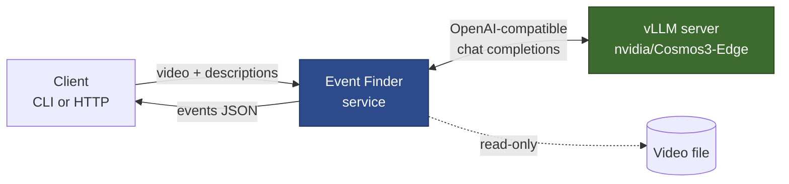
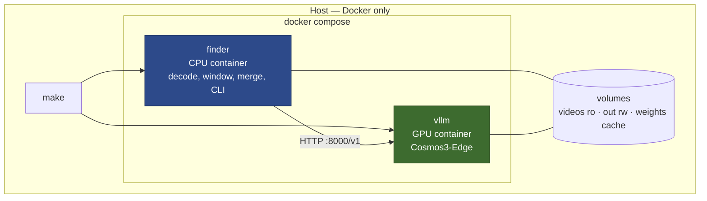
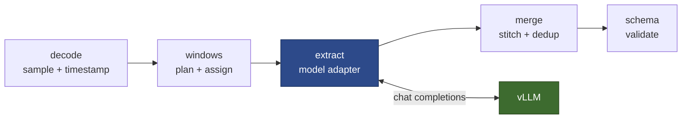
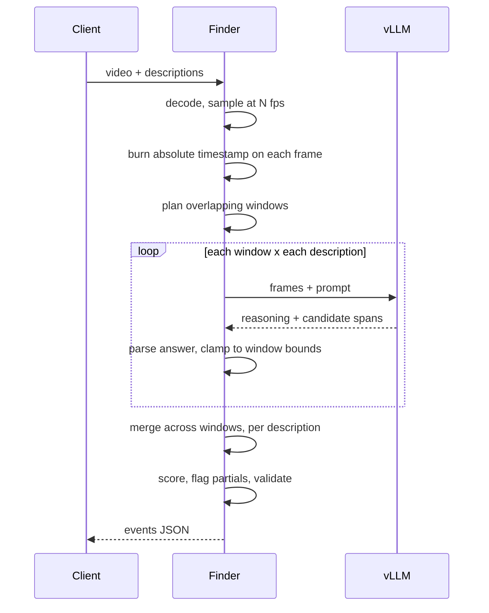
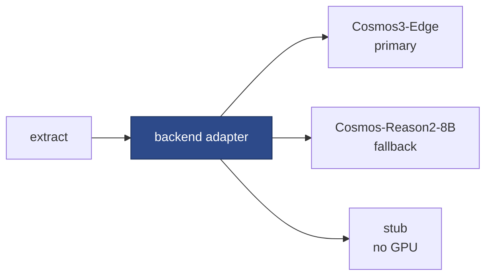
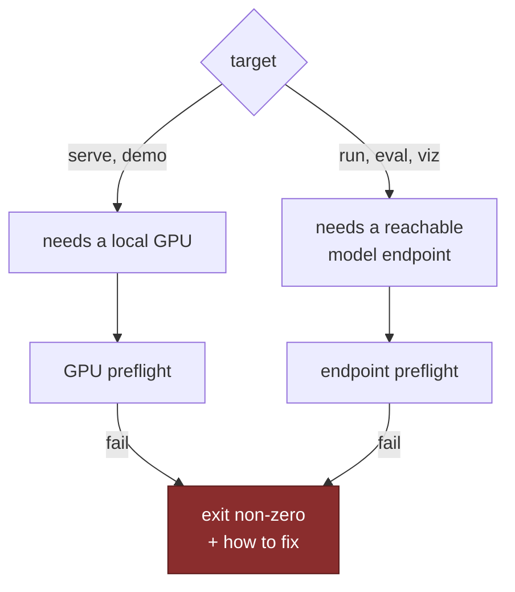
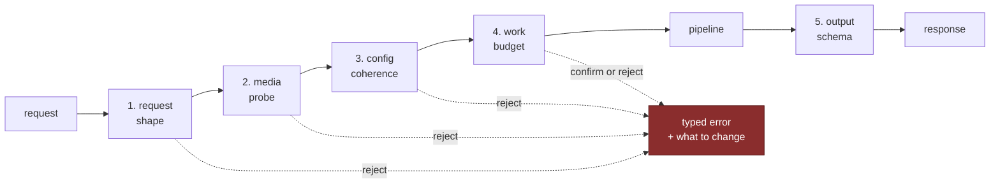

# Design — video event-finding service

High-level design: what the system is, how the pieces connect, and which decisions
are load-bearing. Working notes, verified facts and open risks live in
[`PLAN.md`](PLAN.md).

Status: **architecture agreed, implementation not started.** Nothing in this
document reports a measured result yet. Every number here is either cited to a
primary source or explicitly marked as a hypothesis to be measured.

---

## 1. The contract

One call. In: a video file and one or more plain-language event descriptions.
Out: a list of events with absolute start and end times, the description each
matched, and a ranking signal — in a strict schema.

```
find_events(video, ["a forklift reverses", "the machine stops moving"]) -> Result
```

The client never sees frames, windows, prompts, model names or GPUs. That
concealment *is* the product: the caller describes what they are looking for in
their own words and gets back timecodes.

**Invariants the client can rely on**

| Invariant | Meaning |
|---|---|
| Absolute time | Every `start_s` / `end_s` is seconds from the start of the submitted video, never window-relative |
| Ordered | Events sorted by start time |
| No events is not an error | An empty list, HTTP 200 |
| Bounded | No event can be reported outside the video's real duration |
| Honest truncation | An event the model only partly saw is flagged, not silently clipped |
| Schema-validated | The response is validated before it leaves the process |

---

## 2. System context



Two processes, one boundary. The finder is stateless and holds all the logic; the
model server holds all the weights. They speak the OpenAI chat-completions
protocol, which is what makes the model backend swappable.

**Why split them.** Only the model server needs an accelerator. Everything else is
CPU work that runs anywhere. So a reviewer can exercise the entire pipeline —
decoding, windowing, merging, schema, evaluation — with the model server replaced
by a deterministic stub, then point the same client at a real GPU box by changing
one URL. Both run as containers; see §3.

---

## 3. Deployment — everything runs in Docker

**Nothing runs on the host.** No `pip install`, no Python version to match, no
system ffmpeg, no virtualenv. The only host requirements are Docker and — for the
GPU role — the NVIDIA container toolkit. This is the most direct answer available
to "we want to run it in a few minutes on a machine we own, without reading your
code first": the reviewer's machine state cannot break the run, because the run
does not touch it.



**Two images, two jobs.**

| Service | Image | Needs a GPU | Holds |
|---|---|---|---|
| `finder` | built from this repo, CPU-only | no | decoding, windowing, merging, schema, CLI, eval |
| `vllm` | pinned upstream vLLM image | yes | the model weights and nothing else |

**Volumes are the only surface.** Videos are mounted **read-only** — the service
cannot modify a client's footage. Results go to a writable output directory. The
weight cache is a named volume so a container restart does not re-download several
gigabytes, which would otherwise dominate the "few minutes" bar on a second run.

**Both services are declared in one compose file**, so the reviewer runs one
command. They can also be split across machines: the finder container on a laptop,
`BASE_URL` pointed at a GPU box elsewhere. The split is a configuration choice, not
a different build.

**Pinning.** Both images are pinned to exact tags, and the vLLM version is pinned to
one verified to serve this model. A floating `latest` tag is the single most likely
cause of "it worked for you and not for us", which is precisely the failure the
brief says it is strict about.

**The stub backend** ships inside the finder image, so the whole pipeline can be
exercised with no GPU and no model download at all. It proves the plumbing. It
never produces a reported metric — see §11.

---

## 4. Components



| Component | Responsibility | Why it is its own piece |
|---|---|---|
| `decode` | Open the video, sample frames at a target rate, burn an absolute timestamp onto each | The timestamp overlay is the mechanism the whole system rests on |
| `windows` | Plan overlapping windows over the duration; assign frames; cap frames per window | The long-video answer, and the only place the context limit is reasoned about |
| `extract` | One `(window, query)` → candidate events, via the model adapter | The only component that knows a model exists |
| `merge` | Stitch candidates across window boundaries; de-duplicate; flag truncation | Where overlapping windows become one clean answer |
| `schema` | The public contract, validated | The product surface |

Data flows one way. Only `extract` talks to the network, so everything else is
testable and debuggable offline.

---

## 5. Request flow



---

## 6. The load-bearing mechanisms

### 6.1 Timestamp overlay

The model does not have a clock. It localises in time by **reading a timestamp
printed on the frame** — NVIDIA states this directly: *"Our AI model recognizes
timestamps added at the bottom of each frame for accurate temporal localization"*
([Cosmos-Reason2-8B model card](https://huggingface.co/nvidia/Cosmos-Reason2-8B)).
NVIDIA's own temporal-localization recipe does the same, via an adaptive
timestamp-burning script
([Cosmos Cookbook](https://nvidia-cosmos.github.io/cosmos-cookbook/recipes/post_training/reason1/temporal_localization/post_training.html)).

We burn **absolute, video-relative** time — `t=73.250s`, not `t=1.250s into
window 6`. Two consequences, both good:

- A timestamp the model reports is directly usable. No per-window remapping, so no
  class of off-by-one-window bugs can exist.
- Merging across windows is a comparison of numbers on one shared axis.

> **The mechanism is unconfirmed for our primary model.** The brief states that
> Cosmos 3 Edge "can localise events with timestamps **when prompted correctly**",
> so the *capability* is asserted by the people who set the task. What is not
> asserted is *how*. The burned-overlay mechanism is documented for Cosmos
> Reason 2; the `nvidia/Cosmos3-Edge` model card mentions temporal localization,
> timestamps and event detection **nowhere at all**.
>
> The two models also share little below the API. Edge runs a **Nemotron-H**
> language backbone — a hybrid Mamba-2/Transformer that replaces most self-attention
> with state-space layers — behind a **SigLIP2** vision encoder. Cosmos Reason 2 is
> Qwen3-VL-8B-based. Reading a burned-in timestamp needs the vision encoder to
> resolve small text *and* the model to bind that text to the frame's place in the
> sequence; neither transfers automatically between those architectures. Edge is
> also documented at robot-control resolution 640x360, so **overlay legibility is
> itself a variable to sweep**, not a fixed choice.
>
> So the first experiment on the GPU box tests **two** localisation paths against
> each other on a clip with known ground truth:
>
> 1. **Burned overlay** — this section's approach, documented for Cosmos Reason 2.
> 2. **Native video timing** — pass video through vLLM's video input path and let
>    the model's own frame-timing supply the clock.
>
> Whichever grounds events more accurately becomes the default; the other stays
> available as a config option. This is the capability probe of §10. The adapter in §7 is
> what makes the outcome a choice rather than a rewrite. Given the brief's qualifier, **prompt design is part of
> this experiment, not a detail to settle afterwards.**

### 6.2 Sampling rate

Two documented rates, from different sources, and they disagree:

- **4 fps** — the input rate NVIDIA documents for Cosmos 3 Edge reasoning and for
  Cosmos Reason 2, chosen to match the training setup.
- **8 fps** — what NVIDIA's temporal-localization recipe found optimal after
  testing 4, 8 and 12, against a target of **<30 % mean relative error** relative
  to event duration.

That target comes from a **post-trained** model on a specific dataset, so it is not
a zero-shot guarantee and will not be quoted as one.

We therefore treat fps as a **measured accuracy/cost knob**, not a default to
assert. Sampling rate sets the floor on boundary precision: at 4 fps no boundary
can be located better than 250 ms, before any model error. The repo will report the
sweep and pick from evidence.

### 6.3 Windowing

A video is longer than the model can attend to at once, so we slide a fixed-length
window with a stride shorter than the window.

```
video   ├──────────────────────────────────────────────┤
w0      ├──────────┤
w1            ├──────────┤
w2                  ├──────────┤
              ╰────╯  overlap
```

- **Window length** bounds frames per call, and therefore vision tokens per call.
  It is the knob that keeps cost per call constant no matter how long the video is.
- **Stride < window ⇒ overlap.** Overlap is the entire answer to "what about an
  event that straddles a boundary": with an overlap wider than the longest event we
  care about, that event appears *whole* in at least one window.
- **Frame cap per window.** Even at fixed fps, frames per call are capped and
  subsampled uniformly if exceeded, so a pathological input cannot blow the context
  limit.

Overlap trades cost for recall linearly: overlap fraction *f* multiplies the number
of model calls by roughly `1/(1-f)`. Defaults will be set from the sweep, and the
relationship documented so a client can move the knob knowingly.

### 6.4 Merging across windows

Overlap guarantees duplicates. Each real event appears as a candidate in every
window that saw it. Merging runs **per description**, so two different queries can
never collapse into each other.

```
candidates   ├────┤  ├─────┤
                  ├────┤
merged       ├────┴──┴─────┤   one event, provenance = {w0, w1, w2}
```

Two rules matter more than the thresholds:

- **Bounded chaining.** A merge rule that compares each new candidate to a *running
  span* whose end keeps advancing will chain a dense candidate stream into one
  giant event. The merge must be bounded so that a busy video does not collapse
  into a single detection covering everything.
- **Non-saturating agreement.** Agreement across independent windows is the
  cheapest real evidence available, and it falls out of the merge for free. But if
  agreement only ever pushes confidence up, everything converges on 1.0 and the
  ranking signal the brief asks for stops discriminating. Agreement must inform the
  score without saturating it.

### 6.5 Ranking signal

Deliberately labelled a **heuristic ranking signal, not a calibrated probability**.
Calibrated confidence from a zero-shot VLM is an open research problem, and
claiming otherwise would be the easiest thing in this repo to disprove.

It combines the model's self-reported confidence — a weak prior — with cross-window
agreement, which is independent evidence. It is good enough to sort results and to
threshold. It is not a probability, and the schema documentation says so.

### 6.6 Partial events

After merging, an event can still touch the edge of the region any window actually
observed — at the video's start or end, or where no overlapping neighbour confirmed
it. Its true extent is then unknown.

Reporting a clipped span as if it were exact is a quiet lie. Such events are
flagged instead, so a client can decide whether to trust the boundary. Sufficient
overlap prevents most of these; the flag surfaces the remainder honestly.

---

## 7. The model adapter

`extract` is the only component that knows a model exists, and it talks to it
through a narrow adapter:



**Why this seam exists, concretely.** It is not speculative generality — it is a
hedge against one specific, identified risk.

The design in §6 rests on the model reading burned-in timestamps. For the primary
model that is **undocumented**, and the primary and fallback models are different
architectures all the way down: Nemotron-H + SigLIP2 at 4B versus Qwen3-VL-8B, one
ungated and one gated, with their own prompt conventions and documented frame
rates. Cosmos 3 is also a reasoning model, so a response carries a reasoning pass
before the answer and cannot be parsed as bare JSON.

If the timestamp test fails, what has to change is confined to one component:
prompt shape, response parsing, and possibly the whole localisation strategy for
that backend. Everything in §6.3 through §6.6 — windowing, merging, scoring,
partial-event handling — is arithmetic over `(start, end, score)` tuples and does
not care which model produced them. **Putting the seam here means a negative
result costs a config change and one new adapter, not a redesign.**

The adapter's job is to absorb that: prompt construction, response parsing, and
clamping every reported timestamp into the window's real span so a window can never
emit an event outside the footage it saw. Swapping backends is configuration.

**Backends**

| Backend | Role | Notes |
|---|---|---|
| `nvidia/Cosmos3-Edge` | Primary | 4B, OpenMDW 1.1, **not gated**. Natively served by stock vLLM as `Cosmos3EdgeForConditionalGeneration` — Nemotron-H backbone with a SigLIP2 vision encoder. Recommended by the brief. Timestamp localisation **undocumented** — see §6.1 |
| `nvidia/Cosmos-Reason2-8B` | Fallback | Documented timestamp localisation and fps. Gated, needs a token — hence fallback, not default |
| stub | Development | Deterministic, GPU-free. Proves the pipeline; never produces a metric |

**On serving.** Cosmos 3 is a **Mixture-of-Transformers**: one model, two towers.
The **Reasoner** is autoregressive and interprets multimodal input into text — the
"brain". The **Generator** is a diffusion transformer that synthesises future
video, audio and action by iterative denoising, conditioned on the reasoner.
NVIDIA states that *the reasoner operates independently, while generation requires
both towers together*.

Our task is video in, timestamped text out. That is the Reasoner alone; we never
generate anything. **"Omni" refers to the union of modalities across both towers**,
and **vLLM-Omni** is the separate project that serves the diffusion generator —
which the `--omni` flag switches on. Since we do not generate, `--omni`, the
`vllm/vllm-omni:cosmos3` image and `--no-guardrails` are all out of scope, and
stock vLLM serving the understanding tower is the entire requirement. That keeps
the reviewer's setup to one standard vLLM container.

---

## 8. Output schema

```jsonc
{
  "video": "warehouse_02.mp4",
  "duration_s": 142.6,
  "queries": ["a forklift reverses"],
  "model": "nvidia/Cosmos3-Edge",
  "events": [
    {
      "description": "a forklift reverses",   // which query this matched
      "start_s": 12.40,                       // absolute, seconds from video start
      "end_s": 15.10,
      "confidence": 0.82,                     // ranking signal, NOT a probability
      "evidence": "forklift moving backward toward the rack",
      "partial": false,                       // true if truncated by an observation edge
      "source_windows": [1, 2]                // provenance
    }
  ]
}
```

`evidence` and `source_windows` are there so a result can be argued with. A client
who disagrees with a detection can see what the model claimed to see and which part
of the video produced it — which is what makes the output debuggable rather than
merely machine-readable.

Field names, units and the exact shape are fixed by a schema definition in the
code, validated on the way out. Any change to it is a breaking change to the
contract.

---

## 9. Evaluation design

The brief asks for a hand-labelled set and a temporal metric we can defend.

**The set.** 5–10 clips, 1–3 minutes, hand-labelled with start and end times, mixing
two kinds:

- **Synthetic** clips, where ground truth is exact by construction. These calibrate
  the system and isolate its error from labelling error.
- **Real** footage, which is the only thing that proves it works. Fixed-camera
  operational footage is the target domain.

**The metric.** Event-finding is temporal grounding, so we report **temporal IoU**
based metrics, standard in the moment-retrieval literature:

- Recall@1 at tIoU ∈ {0.3, 0.5, 0.7} — does the top-ranked prediction overlap the
  truth enough?
- Mean tIoU of the best-matching prediction per labelled event.
- Detection precision and recall at a fixed tIoU, for the multi-event framing.
- Latency and cost per video-minute — for an inference service, cost is a result.

Exact-boundary match is deliberately not used. Hand labels are fuzzy and so is the
model; a threshold on overlap is the honest bar. Reporting several thresholds
rather than one shows where accuracy actually falls off.

**Metric isolation.** Metrics are computed per video and then aggregated. Query
strings repeat across clips by design, so pooling all predictions and all labels
into flat lists would let a prediction from one clip satisfy a label in another and
silently inflate every number.

**What we are looking for.** Roboflow has published its own Cosmos 3 evaluation
([blog.roboflow.com/cosmos-3-vision](https://blog.roboflow.com/cosmos-3-vision/)),
finding that it segments activity into structured state sequences reliably without
fine-tuning and handles slow-changing states well, while struggling with
fast-moving actions and with small, similar objects. Our eval set deliberately
spans those cases. Confirming or contradicting a published finding with our own
measured numbers is a more useful answer to "where are the limits" than a table of
scores with no hypothesis behind it.

Expected weak points, to be confirmed or refuted rather than assumed: boundary
precision at tight tIoU, absence-of-motion events such as "the machine stops"
compared with distinctive motion, events shorter than the sampling interval, long
events spanning many windows, and visually similar distractors.

---

## 10. The capability probe

Before the pipeline is trusted, the model is characterised. This is a first-class
component, not a debugging script.

**Why it exists.** The brief asks us to *"understand what it actually guarantees"*
and to report *"where the limits of their abilities are"*. It also states that
Cosmos 3 Edge "can localise events with timestamps when prompted correctly". That
statement is treated here as a **hypothesis to test**, not a specification to build
against — the model card documents no such capability, and inheriting the claim
untested would skip the part of the work that matters.

**What it measures.** On short clips with exact, constructed ground truth — where
labelling error is zero by design — the probe answers four questions:

| Question | Why it decides something |
|---|---|
| Does Edge report event times at all, in a parseable form? | If not, the whole approach changes and we find out on day one |
| **Which mechanism grounds better** — timestamps burned into frames, or vLLM's native video-timing path? | The brief does not say which Edge uses. Burned overlays are documented for Cosmos Reason 2 only |
| At what **precision floor**? Absolute error against known truth | Every downstream metric is read against this number |
| How does that degrade with clip length, event duration, sampling rate and overlay legibility? | These are the knobs; this tells us which ones matter |

**Why the precision floor is the important output.** It separates *the model's*
error from *our pipeline's*. Without it, a mediocre tIoU is unattributable — we
could not say whether the windowing, the merging, or the model was responsible. With
it, every later result has a baseline to be judged against, and the failure analysis
the brief asks for becomes evidence rather than speculation.

**It is cheap and it runs first.** Seconds of footage, a handful of model calls, a
single GPU-hour. It is the first thing executed when a GPU box comes up, before any
eval set is processed.

**Its result is published in the repo either way.** A negative — "the recommended
model could not ground events to better than X, so we did Y" — is a finding the
brief explicitly asks for, and is more useful than a number produced by a model
nobody checked.

---

## 11. Operational interface — Make

`make` is the front door, and **every target is a thin wrapper over `docker
compose`**. No target ever executes project code on the host. The brief's bar is
that a reviewer runs this in minutes without reading the code, so target names have
to be guessable and parameters have to be visible.

```
make help          # self-documenting target list, printed from the Makefile itself
make preflight     # host and container environment checks; run automatically
make probe         # characterise the model: can it ground events, and how precisely
make build         # build the finder image, pull the pinned vLLM image
make serve         # start the model container on the local GPU
make demo          # end-to-end: sample clip + queries -> events JSON  (the front door)
make run           # find events in YOUR video
make eval          # run the labelled eval set, print the metric table
make sweep         # fps / window / stride frontier
make viz           # render the result timeline
make down          # stop containers
make clean         # also drop the weight cache volume
```

Each resolves to something of the shape
`docker compose run --rm finder <cli command>`, with the video mounted read-only
and results written to a mounted output directory.

Every target is parameterised by environment variable, with defaults that work:

| Variable | Default | Purpose |
|---|---|---|
| `MODEL` | `nvidia/Cosmos3-Edge` | Model id. Switching backends is this variable |
| `BASE_URL` | `http://localhost:8000/v1` | Point at a remote GPU box instead of a local one |
| `VIDEO` | the sample clip | Input video for `run` |
| `QUERIES` | sample queries | Newline- or semicolon-separated descriptions |
| `DATASET` | the bundled eval set | Which labelled set `eval` runs against |
| `SAMPLE_FPS` `WINDOW_S` `STRIDE_S` | from config | The sampling and windowing knobs |
| `GPU_HOURLY` | unset | Instance price, for the cost-per-video-minute figure. **Unset means cost is not reported** rather than reported wrongly |
| `ALLOW_NO_GPU` | unset | Explicit opt-in to the stub path. See §11 |
| `OUT_DIR` | `./out` | Host directory results are written to |

Three rules keep this honest:

- **`make help` is generated from the Makefile**, so the documented interface
  cannot drift away from the real one.
- **Defaults are real.** `make demo` with no arguments must produce a real result,
  because that is the command a reviewer will actually type first.
- **Host paths are translated, not assumed.** `VIDEO=/some/path/clip.mp4` is
  mounted into the container and rewritten to the container path, so a caller never
  has to think about the container boundary.

Datasets and models are declared in config files rather than hardcoded in recipes,
so adding either is a data change. The Makefile stays a thin, readable layer over
compose and the CLI — anything with real logic in it belongs in Python, where it
can be debugged.

---

## 12. Preflight and GPU gating

**The subtlety: only one of the two processes needs a GPU.** The finder decodes
video, plans windows and merges results — all CPU work. The model server is what
needs the accelerator. Gating the whole system on a local GPU would break the
legitimate case where the reviewer runs the CLI on a laptop against a GPU box
elsewhere, which is exactly what `BASE_URL` is for.

So the gate goes where the requirement actually is:



**GPU preflight** — required before serving locally, and phrased in Docker terms
because that is where the model actually runs. Each check fails hard, names what it
found, and says what to do about it:

| Check | Failure means |
|---|---|
| Docker daemon reachable, compose available | Nothing can run at all |
| `docker run --rm --gpus all <cuda image> nvidia-smi` succeeds | The single most valuable check: it proves in one command that a GPU exists, the driver works, **and** the NVIDIA container toolkit is installed. Testing `nvidia-smi` on the host would pass while containers still had no GPU — the most common silent failure |
| Reported VRAM ≥ the selected model's requirement | Wrong instance size. The threshold comes from the model registry, so it moves with `MODEL` |
| Driver / CUDA version within the pinned vLLM's supported range | vLLM will fail later and far less clearly |
| Free disk ≥ the weight cache requirement | The weight download dies partway |

**Endpoint preflight** — required before any client target: the endpoint answers,
and it is serving the model we think it is. A mismatch between `MODEL` and what the
server actually loaded produces results attributed to the wrong model, which is
worse than an error.

**Failure is loud and non-zero.** No silent degradation, no automatic fallback to
the stub. A run either used the real model or it failed.

**The one escape hatch.** `ALLOW_NO_GPU=1` selects the stub backend so the pipeline
can be exercised with no accelerator. It is opt-in only, it prints a banner on
every run, its results are stamped as stub-generated in the output, and the eval
harness **refuses to compute metrics** from them. Convenience for development must
not be able to masquerade as a result.

---

## 13. Input validation

Validation happens in stages, cheapest first, so a bad request fails in
milliseconds rather than after a GPU has been paid for.



**1. Request shape** — no file touched yet. Video path exists and is readable;
file size within the configured maximum; container format in the allowlist. At
least one query; each non-blank and within a length bound; query count within a
maximum; duplicates rejected rather than silently deduplicated, since a duplicate
usually means the caller made a mistake.

**2. Media probe** — metadata only, no full decode. The file is genuinely a video
with at least one video stream. Duration within bounds — a lower bound catches
truncated uploads, an upper bound is a real limit we state rather than discover.
Resolution and frame rate within sane ranges.

**3. Config coherence** — the knobs must describe a system that can work:

| Constraint | Why it is not optional |
|---|---|
| `0 < stride_s ≤ window_s` | Stride greater than window leaves **unobserved gaps** — footage nothing ever looks at. Silently missing events there is the worst failure this system can have |
| `sample_fps > 0`, within a supported range | Below the model's documented rate, temporal localisation degrades in ways the metrics will not explain |
| `max_frames_per_window` ≥ a floor | Too few frames per call and the model cannot see the event at all |
| merge thresholds within their valid ranges | Out-of-range values silently produce either one giant event or no merging |

An overlap of zero is legal but warned about, because it removes the mechanism
that recovers boundary-straddling events.

**4. Work budget** — the check that protects the wallet. Before any model call, the
work is fully predictable from the inputs:

```
frames  = duration_s x sample_fps
windows = ceil((duration_s - window_s) / stride_s) + 1
calls   = windows x queries
```

If the estimate exceeds the configured budget, the run **stops and reports the
estimate** — call count, frame count, projected wall time — rather than starting a
job that quietly runs for hours. Raising the budget is explicit. A two-hour video
with ten queries should be a decision, not an accident.

**5. Output schema** — the result is validated before it leaves the process, so a
malformed response is our error and never the client's problem.

**Error model.** A small exception hierarchy, each mapping to a stable exit code
and HTTP status: invalid input, unprocessable media, misconfiguration, budget
exceeded, backend unavailable. Every message states what was wrong, what was
expected, and which parameter changes it. `UnprocessableMedia` is distinct from
`InvalidInput` because "your file is not a video I can read" and "you asked for
something impossible" need different responses from the caller.

---

## 14. Risks

| Risk | Impact | Mitigation |
|---|---|---|
| **Cosmos3-Edge may not read burned-in timestamps** — undocumented for Edge specifically | Invalidates §6.1 for the primary model | Test first thing on the GPU box, before any other work. Adapter makes the fallback a config change |
| No published VRAM figure for the Edge reasoner | Wrong instance size, wrong cost figures | Measure on the box before choosing the instance or writing any cost number |
| No vLLM recipe exists for Edge, only for Nano/Super | Serving flags are inferred | Pin the vLLM version, record the exact working command, verify before relying on it |
| fps 4 vs 8 unresolved for this model and task | Accuracy left on the table, or cost wasted | Sweep it; report the frontier instead of asserting a default |
| Real footage licensing | Cannot publish the eval set | Settle licence before labelling. Synthetic clips are unencumbered by construction |

---

## 15. Out of scope

The brief states that tests, CI, linters, production-grade deployment, service
scaling and advanced security are not evaluated, and asks for focus on the
solution, its value, and ease of use. This design follows that.

Also deliberately excluded: a control plane or UI for picking models and
provisioning GPUs. It would add setup friction against the first-try-run bar, and
it is dev tooling rather than the deliverable. The only interface beyond the CLI is
an optional timeline view of results — a way to see where the system fails, not a
way to launch it.
